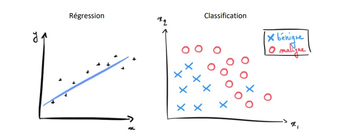
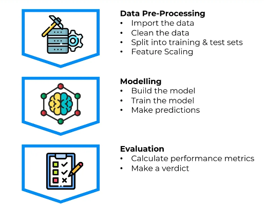

# cour 01 : Introduction au Machine Learning (ML)

## 1.Qu'est-ce que le Machine Learning (ML) ?

> Le Machine Learning, ou apprentissage automatique , est une branche de l'intelligence artificielle qui permet aux systèmes informatiques d'apprendre à partir de données. Plutôt que d'être explicitement programmées pour effectuer une tâche, ces machines utilisent des algorithmes qui s'adaptent et évoluent à travers l'expérience.

-   **Exemples d'Utilisation du Machine Learning (ML) :**

    -   **Moteur de Recherche :**

        Les moteurs de recherche, tels que Google, utilisent intensivement le Machine Learning pour améliorer la pertinence des résultats de recherche. Les algorithmes de ML analysent les habitudes de recherche passées, les clics et d'autres comportements pour comprendre les intentions de l'utilisateur et fournir des résultats plus personnalisés et pertinents au fil du temps. Cela permet une expérience de recherche plus précise et adaptée à chaque utilisateur.

    -   **Reconnaissance Faciale :**

        La reconnaissance faciale est un domaine où le ML excelle. Les algorithmes de reconnaissance faciale utilisent des modèles d'apprentissage en profondeur pour identifier et authentifier des visages dans des images ou des vidéos. Ces systèmes sont largement utilisés dans la sécurité, le déverrouillage de smartphones, la gestion des accès.

    -   **Algorithmes de Recommandation :**

        Les algorithmes de recommandation sont utilisés par des plates-formes telles que Netflix, Amazon, ou Spotify pour suggérer des contenus aux utilisateurs en fonction de leurs préférences passées. Ces systèmes analysent les historiques de visionnage, d'achat ou d'écoute pour prédire les goûts de l'utilisateur et offrir des recommandations personnalisées. Cela améliore l'expérience utilisateur en fournissant des suggestions adaptées à chaque individu.

-   **Les Différentes Stratégies en ML :**

    Pour donner à un ordinateur la capacité d’apprendre, on utilise des méthodes d’apprentissage qui sont fortement inspirées de la façon dont nous, les êtres humains, apprenons à faire des choses. Parmi ces méthodes, on compte :

    -   L’apprentissage supervisé (`Supervised Learning`)
    -   L’apprentissage non supervisé (`Unsupervised Learning`)
    -   L’apprentissage par renforcement (`Reinforcement Learning`)

## 2. **Apprentissage Supervisé :**

### a. **Définition :**

> **L'apprentissage supervisé:** est l'une des branches fondamentales du Machine Learning, où les modèles sont entraînés à partir d'un ensemble de données étiquetées. l'apprentissage supervisé repose sur des exemples où chaque entrée est associée à une sortie désirée.

-   **Les étapes clés de ce processus comprennent :**

    1. **Ensemble d'Entraînement :** Un ensemble de données étiquetées est fourni au modèle, où chaque exemple est associé à une sortie attendue. Cet ensemble sert de base pour l'apprentissage.

    2. **Choix du Modèle :** On sélectionne un modèle algorithmique approprié en fonction du type de problème à résoudre. Il peut s'agir de régressions linéaires, de machines à vecteurs de support, ou de réseaux de neurones, entre autres.

    3. **Entraînement du Modèle :** Le modèle est entraîné sur l'ensemble d'entraînement en ajustant ses paramètres pour minimiser la différence entre les prédictions du modèle et les sorties réelles.

    4. **Validation et Évaluation :** Une fois le modèle entraîné, il est évalué sur un ensemble de validation distinct pour s'assurer qu'il généralise bien aux données qu'il n'a pas vues pendant l'entraînement.

### b. **Les applications du Supervised Learning:**

Avec le Supervised Learning on peut développer des modèles pour résoudre 2 types de problèmes :

-   **Les problèmes de Régression :**

    -   **Définition :** Dans les problèmes de régression, l'objectif est de prédire une valeur continue en fonction des caractéristiques d'entrée.

    -   **exemple :**

        -   Prédire le prix d’un appartement (𝑦) selon sa surface habitable (𝑥)

        -   Prédire la quantité d’essence consommée (𝑦) selon la distance parcourue (𝑥)

-   **Problèmes de Classification :**

    -   **Définition :** Dans les problèmes de classification, l'objectif est d'attribuer une catégorie ou une classe à chaque exemple d'entrée.

    -   **exemple :**

        -   Prédire si un email est un spam (𝑐𝑙𝑎𝑠𝑠𝑒 𝑦 = 1) ou non (𝑐𝑙𝑎𝑠𝑠𝑒 𝑦 = 0) selon le nombre de liens présent dans l’email (𝑥)

        -   Prédire si une tumeur est maligne (𝑦 = 1) ou bénigne (𝑦 = 0) selon la taille de la tumeur (𝒙𝟏) et l’âge du patient (𝒙𝟐)

## 3.**Apprentissage Non Supervisé :**

### a. **Définition:**

> **L'apprentissage non supervisé:** est une branche du Machine Learning où l'algorithme est laissé à lui-même pour découvrir des structures ou des motifs intrinsèques dans les données, sans avoir de données étiquetées. Contrairement à l'apprentissage supervisé qui nécessite une supervision explicite, l'apprentissage non supervisé est plus axé sur l'exploration et la détection de tendances naturelles dans les données.

-   **Caractéristiques de l'Apprentissage Non Supervisé :**

    1. **Aucune Étiquette :** Les données utilisées pour l'entraînement ne sont pas étiquetées, ce qui signifie qu'il n'y a pas d'informations préalables sur les résultats attendus.

    2. **Découverte de Structures :** L'objectif est d'identifier des structures, des regroupements ou des corrélations intrinsèques dans les données sans avoir de directives spécifiques.

    3. **Exploration Automatique :** Les algorithmes d'apprentissage non supervisé sont conçus pour explorer les données de manière autonome, en déterminant des modèles sans intervention humaine directe.

### b. Exemples de Problèmes en Apprentissage Non Supervisé :

-   **Clustering (Regroupement) :**

    -   **Description :** Regrouper des données similaires en ensembles distincts, sans connaître à l'avance les catégories.
    -   **Exemple :** Classification automatique des clients d'un site de commerce électronique en groupes basés sur leurs comportements d'achat.

-   **Détection d'Anomalies :**

    -   **Description :** Identifier des points de données qui diffèrent significativement du reste.
    -   **Exemple :** Détection d'anomalies dans les transactions financières pour repérer des fraudes potentielles.

-   **Apprentissage Non Supervisé en Traitement du Langage Naturel (NLP) :**

    -   **Description :** Découverte de structures et de relations dans des données textuelles sans étiquettes.
    -   **Exemple :** Clustering de documents pour regrouper des articles de presse similaires sans utiliser de catégories préexistantes.

## 4.**Apprentissage par Renforcement :**

### a. **Définition :**

> **L'apprentissage par renforcement:** est une branche du Machine Learning où un agent apprend à prendre des actions dans un environnement pour maximiser une récompense cumulative. Contrairement à l'apprentissage supervisé, il n'y a pas de données étiquetées fournies à l'avance. L'agent explore l'environnement, prend des décisions, observe les conséquences de ses actions et ajuste sa stratégie pour maximiser les récompenses au fil du temps.

-   **Caractéristiques de l'Apprentissage par Renforcement :**

    1. **Interaction avec l'Environnement :** L'agent interagit avec un environnement dynamique en prenant des actions.

    2. **Récompenses et Pénalités :** L'agent reçoit des récompenses ou des pénalités en fonction des actions qu'il prend.

    3. **Objectif à Long Terme :** L'objectif de l'agent est de maximiser la récompense cumulée sur une période prolongée.

### b. Exemples de Problèmes en Apprentissage par Renforcement :

-   **Jeux Vidéo :**

    -   **Description :** Entraîner un agent à jouer à des jeux vidéo en prenant des actions qui maximisent le score ou la progression dans le jeu.
    -   **Exemple :** AlphaGo, un programme d'intelligence artificielle qui a appris à jouer au jeu de Go de manière autonome.

-   **Robotique Autonome :**

    -   **Description :** Enseigner à un robot à accomplir des tâches complexes en ajustant ses actions pour maximiser la réussite de la mission.
    -   **Exemple :** Enseignement d'un robot à assembler des objets en utilisant des bras robotiques.

-   **Optimisation de Portefeuille :**

    -   **Description :** Sélectionner un portefeuille d'investissements pour maximiser les rendements tout en minimisant les risques.
    -   **Exemple :** Optimisation des allocations d'actifs dans un portefeuille d'investissements en fonction des conditions du marché.

### RQ **Processus du ML:**

