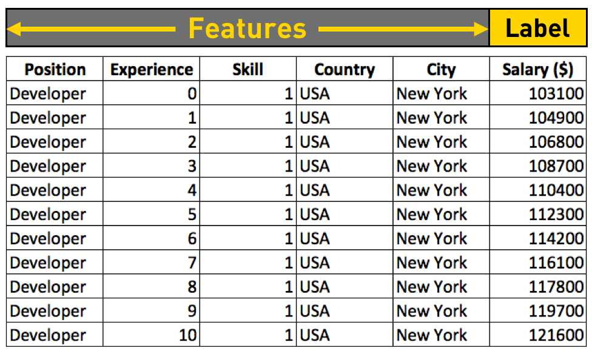
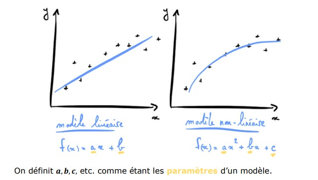
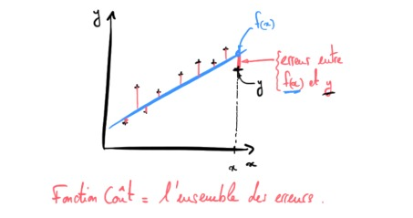

# cour 02 : **Apprentissage Supervisé :**  

## 1. **Introduction:**

L'apprentissage supervisé est l'une des branches fondamentales du Machine Learning, où les modèles sont entraînés à partir d'un ensemble de données étiquetées.  l'apprentissage supervisé repose sur des exemples où chaque entrée est associée à une sortie désirée.

>**Apprentissage Supervisé :** Les modèles sont entraînés sur un ensemble de données étiquetées, où l'algorithme apprend à faire des prédictions en se basant sur des exemples de paires entrée-sortie.

## 2. **Les 4 notions clefs du Apprentissage Supervisé:**

- Pour maîtriser l’apprentissage supervisé, il faut absolument comprendre et connaitre les 4 notions suivantes :
    - **Le Dataset**
    - **Le Modèle et ses paramètres**
    - **La Fonction Coût**
    - **L’Algorithme d’apprentissage**

### 2.1 **Le Dataset:**

- **Description :** Le dataset est l'ensemble de données utilisé pour entraîner, valider et tester le modèle. Il se compose de caractéristiques (``features``) qui décrivent les exemples et de labels ( ``traget``) qui représentent les sorties attendues pour chaque exemple. 

En Machine Learning, on compile ces exemples (𝒙, 𝒚) dans un tableau  que l’on appelle **Dataset** : 

- La variable 𝒚 porte le nom de *target* (la cible). C’est la  valeur que l’on cherche à prédire. 

- La variable 𝒙 porte le nom de *feature* (facteur). Un facteur  influence la valeur de 𝒚, et on a en général beaucoup de  features (𝒙𝟏, 𝒙𝟐, … ) dans notre Dataset que l’on regroupe dans une matrice 𝑿.  

- **formalement:**

Formellement, un ensemble de données peut être représenté par une matrice de caractéristiques $X$ et un vecteur cible $Y$ de la manière suivante :

#### Matrice de Caractéristiques $X$  :
- $X$ est une matrice où chaque ligne représente un exemple d'entraînement, et chaque colonne représente une caractéristique de cet exemple.
- Si vous avez $m$ exemples d'entraînement et $n$ caractéristiques, alors $X$ est une matrice de dimensions $m \times n$.
- La notation $X_{ij}$ représente la valeur de la caractéristique $j$ pour l'exemple $i$.

Formellement, $X$ peut être défini comme suit :

$$
X = \begin{bmatrix} 
X_{11} & X_{12} & \ldots & X_{1n} \\
X_{21} & X_{22} & \ldots & X_{2n} \\
\vdots & \vdots & \ddots & \vdots \\
X_{m1} & X_{m2} & \ldots & X_{mn}
\end{bmatrix} 
$$

#### Vecteur Cible ($Y$) :
- $Y$ est un vecteur qui contient les sorties attendues (étiquettes) pour chaque exemple d'entraînement.
- Si vous avez $m$ exemples d'entraînement, alors $Y$ est un vecteur de dimensions $m \times 1$.
- La notation $Y_i$ représente la valeur de la cible pour l'exemple $i$.

Formellement, $Y$ peut être défini comme suit :

$$ 
Y = \begin{bmatrix} 
Y_{1} \\
Y_{2} \\
\vdots \\
Y_{m}
\end{bmatrix} 
$$

### 2.2 **Le Modèle et ses Paramètres :**

- **Description :** Le modèle est l'algorithme ou la structure mathématique utilisé pour faire des prédictions à partir des données d'entrée. Les modèles ont des paramètres ajustables qui sont appris pendant l'entraînement. Ces paramètres sont ajustés pour minimiser une fonction de coût.

Voici quelques-uns des modèles couramment utilisés en apprentissage supervisé :

- **Régression Linéaire :**
   - **Type de Problème :** Régression (prédiction de valeurs continues).
   - **Description :** Modèle qui tente de trouver une relation linéaire entre les caractéristiques et la cible.

- **Régression Logistique :**
   - **Type de Problème :** Classification binaire.
   - **Description :** Utilisé pour modéliser la probabilité d'appartenance à une classe.

- **Machines à Vecteurs de Support (SVM) :**
   - **Type de Problème :** Classification ou régression.
   - **Description :** Trouve l'hyperplan qui maximise la marge entre les différentes classes.

- **Arbres de Décision :**
   - **Type de Problème :** Classification ou régression.
   - **Description :** Structure arborescente où chaque nœud représente une décision basée sur une caractéristique.

### 2.3. **La Fonction Coût :**

- **Description :** La fonction coût mesure la différence entre les prédictions du modèle et les sorties réelles (étiquettes) dans l'ensemble d'entraînement. 

L'objectif de l'apprentissage est de minimiser cette fonction coût. Des fonctions coût courantes incluent la somme des carrés des erreurs pour les problèmes de régression et l'entropie croisée pour les problèmes de classification.

- **Formellement:**

La fonction de coût (ou fonction d'erreur) mesure la différence entre les prédictions d'un modèle et les valeurs réelles dans l'ensemble d'entraînement. 

L'objectif est de minimiser cette fonction de coût pendant le processus d'apprentissage. 

Formellement, la fonction de coût ($J$) peut être définie comme suit, en fonction du type de problème (régression, classification, etc.) :

De manière générale, la fonction de coût ($J$) en apprentissage supervisé mesure l'écart entre les prédictions du modèle ($f_\theta(x^{(i)})$) et les valeurs réelles ($y^{(i)}$) pour chaque exemple d'entraînement. 

La forme précise de la fonction de coût dépend du type de problème que vous résolvez (régression, classification, etc.).

La formulation générale pour la fonction de coût peut être exprimée comme suit :

$$ J(\theta) = \frac{1}{m} \sum_{i=1}^{m} L(f_\theta(x^{(i)}), y^{(i)}) $$

où :
- $m$ est le nombre d'exemples d'entraînement.
- $f_\theta(x^{(i)})$ est la prédiction du modèle pour l'exemple $i$.
- $y^{(i)}$ est la valeur réelle (étiquette) de l'exemple $i$.
- $L$ est une fonction de perte (loss function) qui mesure l'écart entre la prédiction et la vraie valeur.

La fonction de perte ($L$) dépend du type de problème. 

La clé est d'ajuster les paramètres ($\theta$) du modèle pour minimiser cette fonction de coût, ce qui se fait généralement à l'aide d'algorithmes d'optimisation tels que la descente de gradient.

- **Exemples :**

- **Problème de Régression :**
    - **Fonction de Coût (Régression Linéaire) :**

$$ 
J(\theta) = \frac{1}{2m} \sum_{i=1}^{m} (h_\theta(x^{(i)}) - y^{(i)})^2 
$$

où $m$ est le nombre d'exemples d'entraînement, $h_\theta(x^{(i)})$ est la prédiction du modèle pour l'exemple $i$, $y^{(i)}$ est la valeur réelle, et $\theta$ sont les paramètres du modèle.

    
- **Problème de Classification Binaire :**
    - **Fonction de Coût (Régression Logistique) :**
        
$$ 
J(\theta) = -\frac{1}{m} \sum_{i=1}^{m} [y^{(i)} \log(h_\theta(x^{(i)})) + (1 - y^{(i)}) \log(1 - h_\theta(x^{(i)}))] 
$$

où $m$ est le nombre d'exemples d'entraînement, $h_\theta(x^{(i)})$ est la probabilité prédite par le modèle que l'exemple $i$ appartienne à la classe positive, $y^{(i)}$ est la valeur réelle (0 ou 1), et $\theta$ sont les paramètres du modèle.

- **Problème de Classification Multiclasse (Softmax) :**
    - **Fonction de Coût (Softmax) :**
        
$$ 
J(\theta) = -\frac{1}{m} \sum_{i=1}^{m} \sum_{j=1}^{K} [y_k^{(i)} \log(h_\theta(x^{(i)})_k)] 
$$

où $m$ est le nombre d'exemples d'entraînement, $K$ est le nombre de classes, $h_\theta(x^{(i)})_k$ est la probabilité prédite par le modèle que l'exemple $i$ appartienne à la classe $k$, $y_k^{(i)}$ est 1 si l'exemple $i$ appartient à la classe $k$ et 0 sinon, et $\theta$ sont les paramètres du modèle.

### 2.4. **L'Algorithme d'Apprentissage :**

- **Description :** L'algorithme d'apprentissage est la méthode utilisée pour ajuster les paramètres du modèle afin de minimiser la fonction coût. Il s'agit souvent d'algorithmes d'optimisation tels que la descente de gradient stochastique (SGD) qui ajustent progressivement les paramètres pour converger vers une configuration qui produit des prédictions précises.

- **Exemples d'algorithmes d'apprentissage couramment utilisés :**

    - **Descente de Gradient (Gradient Descent) :**
        - **Type :** Algorithme d'optimisation.
        - **Description :** Ajuste progressivement les paramètres du modèle dans la direction opposée du gradient de la fonction de coût pour minimiser cette fonction.

    - **Stochastic Gradient Descent (SGD) :**
        - **Type :** Variation de la descente de gradient.
        - **Description :** Une approche plus efficace où les mises à jour des paramètres sont effectuées pour un seul exemple d'entraînement à la fois.

    - **Mini-Batch Gradient Descent :**
        - **Type :** Variation de la descente de gradient.
        - **Description :** Les mises à jour des paramètres sont effectuées sur un petit sous-ensemble (mini-batch) des exemples d'entraînement.

    - **Random Forest :**
        - **Type :** Méthode d'ensemble.
        - **Description :** Utilise un ensemble d'arbres de décision pour améliorer la robustesse et la généralisation du modèle.

    - **K-Nearest Neighbors (KNN) :**
        - **Type :** Algorithme basé sur l'instance.
        - **Description :** Classifie un point en se basant sur les classes des k voisins les plus proches.

