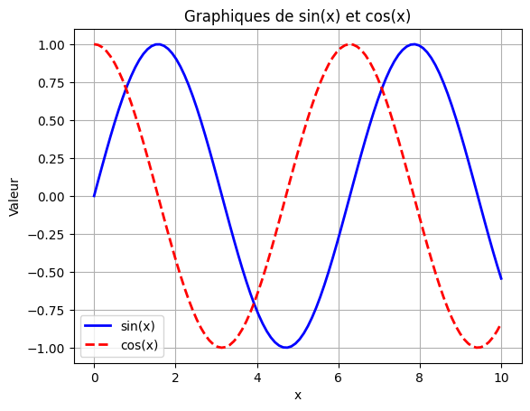
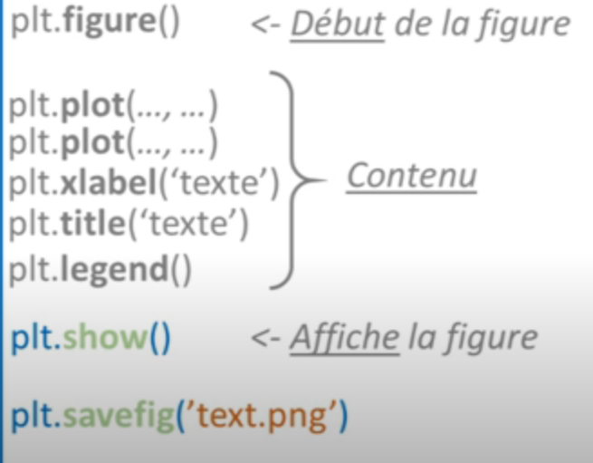
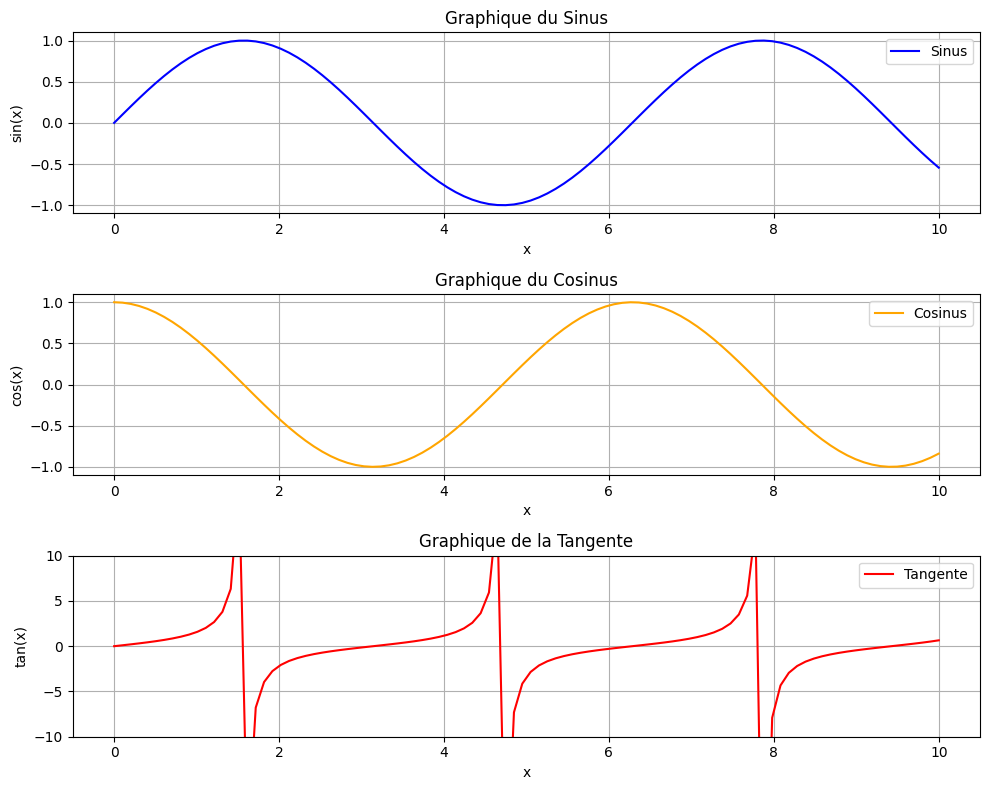
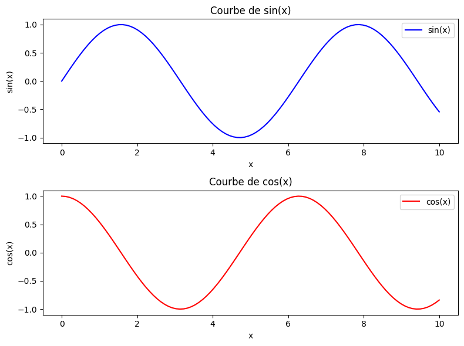

# cour 02 : **plot**

## 1. **la fonction `plot`:**

-   **Description:**

    > La fonction `plt.plot()` de Matplotlib est utilisée pour tracer des graphiques linéaires en 2D. Cette fonction offre une grande flexibilité pour personnaliser l'apparence des graphiques, notamment les couleurs, les styles de ligne, la largeur des lignes, et les étiquettes.

-   **Syntaxe:**

    ```python
    plt.plot(x, y, label='label', lw=1, ls='-', c='color')
    ```

    -   **`x`** : Les coordonnées en abscisse (axe des x) des points à tracer.
    -   **`y`** : Les coordonnées en ordonnée (axe des y) des points à tracer.
    -   **`label`** : Une chaîne de caractères qui sert à donner un nom à la ligne dans la légende.
    -   **`lw` (ou `linewidth`)** : Détermine l'épaisseur de la ligne tracée. Par défaut, la valeur est de 1.
    -   **`ls` (ou `linestyle`)** : Définit le style de la ligne : `--` Ligne pointillée .
    -   **`c` (ou `color`)** : Définit la couleur de la ligne. (comme `'red'` ou `'blue'`).

-   **Exemple:**

    ```python
    import matplotlib.pyplot as plt
    import numpy as np

    # Données
    x = np.linspace(0, 10, 100)  # 100 points entre 0 et 10
    y1 = np.sin(x)                # Sinus des points
    y2 = np.cos(x)                # Cosinus des points

    # Création du graphique
    plt.plot(x, y1, label='sin(x)', lw=2, ls='-', c='blue')  # Ligne sin(x)
    plt.plot(x, y2, label='cos(x)', lw=2, ls='--', c='red')  # Ligne cos(x)

    # Personnalisation du graphique
    plt.title('Graphiques de sin(x) et cos(x)')
    plt.xlabel('x')
    plt.ylabel('Valeur')
    plt.legend()  # Affiche la légende
    plt.grid(True)  # Affiche la grille
    plt.show()
    ```

    

## 2. **Cycle de vie d'un figure:**

-   **cycle de vie:**

    ```python
    import matplotlib.pyplot as plt

    # Étape 1: Créer une figure
    plt.figure()  # Ou fig, ax = plt.subplots() pour plus de contrôle

    # Étape 2: Tracer des données
    x = [i for i in range(0,100)]
    y = x**2
    plt.plot(x, y, label='Données', color='blue', marker='o')

    # Étape 3: Personnalisation
    plt.title("Mon Titre")
    plt.xlabel("Axe X")
    plt.ylabel("Axe Y")
    plt.legend()

    # Étape 4: Sauvegarde (si nécessaire)
    plt.savefig("ma_figure.png")

    # Étape 5: Affichage
    plt.show()

    # Étape 6: Fermeture
    plt.close()
    ```



## 3. **la fonction `subplot`:**

-   **Description:**

    > La fonction `subplot` dans Matplotlib est utilisée pour créer plusieurs sous-graphes (subplots) dans une seule figure. Cela permet de visualiser plusieurs graphiques côte à côte dans la même fenêtre, facilitant la comparaison et l'analyse des données.

-   **Syntaxe:**

    ```python
    subplot(nrows, ncols, index)
    ```

    -   **`nrows`** : Nombre de lignes de sous-graphes.
    -   **`ncols`** : Nombre de colonnes de sous-graphes.
    -   **`index`** : Position du sous-graphe courant (1 pour le premier, 2 pour le deuxième, etc.).

-   **Exemple:**

    ```python
    import matplotlib.pyplot as plt
    import numpy as np

    # Création de données d'exemple
    x = np.linspace(0, 10, 100)
    y1 = np.sin(x)
    y2 = np.cos(x)
    y3 = np.tan(x)

    # Création d'une figure avec 3 sous-graphes
    plt.figure(figsize=(10, 8))

    # Premier subplot : Sinus
    plt.subplot(3, 1, 1)  # 3 lignes, 1 colonne, 1er subplot
    plt.plot(x, y1, label='Sinus', color='blue')
    plt.title('Graphique du Sinus')
    plt.xlabel('x')
    plt.ylabel('sin(x)')
    plt.grid()
    plt.legend()

    # Deuxième subplot : Cosinus
    plt.subplot(3, 1, 2)  # 3 lignes, 1 colonne, 2ème subplot
    plt.plot(x, y2, label='Cosinus', color='orange')
    plt.title('Graphique du Cosinus')
    plt.xlabel('x')
    plt.ylabel('cos(x)')
    plt.grid()
    plt.legend()

    # Troisième subplot : Tangente
    plt.subplot(3, 1, 3)  # 3 lignes, 1 colonne, 3ème subplot
    plt.plot(x, y3, label='Tangente', color='red')
    plt.title('Graphique de la Tangente')
    plt.xlabel('x')
    plt.ylabel('tan(x)')
    plt.ylim(-10, 10)  # Limiter l'axe y pour la tangente
    plt.grid()
    plt.legend()

    # Ajuster l'espacement entre les subplots
    plt.tight_layout()

    # Afficher la figure
    plt.show()
    ```



## 4. **Approche `POO`:**

-   **Définition:**

    -   L'approche orientée objet (POO) dans Matplotlib consiste à manipuler directement les objets de la figure et des axes pour créer et personnaliser les graphiques. Plutôt que d'utiliser des fonctions globales (comme `plt.plot()` ou `plt.title()`), on travaille avec les objets `Figure` et `Axes` créés explicitement, ce qui offre plus de contrôle et permet de gérer facilement plusieurs sous-graphiques dans une figure.

    -   En POO avec Matplotlib, une **`Figure`** représente l'ensemble du graphique, et un **`Axes`** représente une seule zone de dessin dans cette figure, où les données sont tracées. Cette approche est particulièrement utile pour organiser des sous-graphiques complexes et pour contrôler les propriétés individuelles de chaque graphique.

-   **Syntaxe:**

    ```py
    fig , ax = plt.subplots(2 , 1 , sharex=True)

    ax[0].plot(x ,y , label="label 1")
    ax[0].legend()

    ax[1].plot(x , y_2 , label="label 2")
    ax[1].legend()

    plt.show()
    ```

    -   **Créer une Figure et des Axes** : Utilisez `plt.subplots()` pour initialiser une figure et y ajouter un ou plusieurs axes.
    -   **Travailler avec les Axes** : Chaque objet `Axes` dispose de méthodes pour personnaliser les graphiques, ajouter des titres, des labels, des légendes, etc.
    -   **Afficher la figure** : Utilisez `plt.show()` pour afficher la figure.

-   **Exemple :**

```python
import matplotlib.pyplot as plt
import numpy as np

# Génération des données
x = np.linspace(0, 10, 100)
y1 = np.sin(x)
y2 = np.cos(x)

# Création de la figure et des axes
fig, (ax1, ax2) = plt.subplots(2, 1, figsize=(8, 6))

# Tracé sur le premier subplot (ax1)
ax1.plot(x, y1, color="blue", label="sin(x)")
ax1.set_title("Courbe de sin(x)")       # Titre pour le premier graphique
ax1.set_xlabel("x")                     # Label de l'axe x
ax1.set_ylabel("sin(x)")                # Label de l'axe y
ax1.legend()                            # Ajout de la légende

# Tracé sur le deuxième subplot (ax2)
ax2.plot(x, y2, color="red", label="cos(x)")
ax2.set_title("Courbe de cos(x)")       # Titre pour le deuxième graphique
ax2.set_xlabel("x")                     # Label de l'axe x
ax2.set_ylabel("cos(x)")                # Label de l'axe y
ax2.legend()                            # Ajout de la légende

# Affichage de la figure
plt.tight_layout()  # Ajuste automatiquement l'espacement entre les subplots
plt.show()
```


