# cour 03 : **Graphiques Importants:**

## 1. **Graphique de Classification:**

-   **Description:**

    -   Ce graphique montre la séparation entre les classes en fonction de certaines caractéristiques.

    -   Pour deux caractéristiques, par exemple, chaque point représente un échantillon et est coloré selon sa classe. La frontière de décision est la ligne ou la zone où le modèle sépare les classes

-   **Syntaxe :**

    ```python
    plt.scatter(x, y, s=None, c=None, cmap=None, alpha=None)
    ```

    -   **x** : Coordonnées en abscisse des points (tableau ou liste).
    -   **y** : Coordonnées en ordonnée des points (tableau ou liste).
    -   **s** : Taille des points. Peut être un nombre unique ou une liste pour des tailles différentes.
    -   **c** : Couleurs des points. Peut être un nom de couleur, une liste de couleurs, ou un tableau pour représenter une variable catégorielle ou continue.
    -   **cmap** : Colormap à utiliser si `c` est une variable numérique.
    -   **alpha** : Transparence des points (valeur entre 0 et 1).

-   **Exemple d'utilisation:**

```python
import numpy as np
import matplotlib.pyplot as plt
from sklearn.datasets import load_iris
df = load_iris()
x = df.data
y = df.target

plt.scatter(x[:,0] , x[:,1] , c=y , alpha=0.5 , s=x[:,2]*100)
plt.xlabel("longueur sépal")
plt.ylabel("largeur sépal ")
```

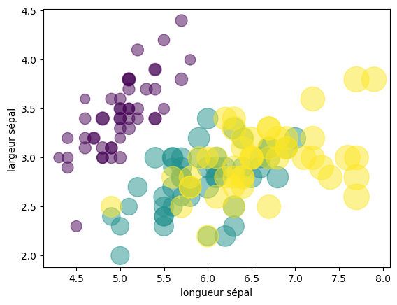

```python
plt.scatter(x[:, 0], x[:, 1], c=y, cmap='viridis')
plt.xlabel("Longueur sépal")
plt.ylabel("Largeur sépal")
plt.colorbar(ticks=np.unique(y), label="Classe")
plt.show()

```

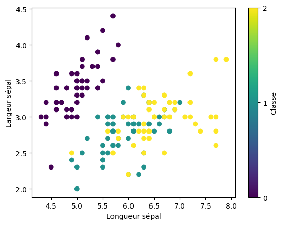

## 2. **Graphiques 3D:**

-   **Description:**

    -   Pour créer des graphiques 3D en Python, `matplotlib` fournit un sous-module appelé `mpl_toolkits.mplot3d`. Avec celui-ci, vous pouvez réaliser des visualisations en trois dimensions, telles que des nuages de points, des surfaces, ou des courbes.

    -   Avant de créer un graphique 3D, vous devez initialiser un axe 3D en utilisant `Axes3D` :

        ```python
        import matplotlib.pyplot as plt
        from mpl_toolkits.mplot3d import Axes3D
        ax = plt.axes(projection="3d")
        ```

-   **Nuage de points 3D: `ax.scatter(x , y , z)`**

    Un nuage de points 3D (`scatter plot`) est idéal pour visualiser des ensembles de données en trois dimensions.

    ```python
    ax = plt.axes(projection='3d')
    ax.scatter(x[:,1] , x[:,2] , x[:,3] , c=y )
    ```

    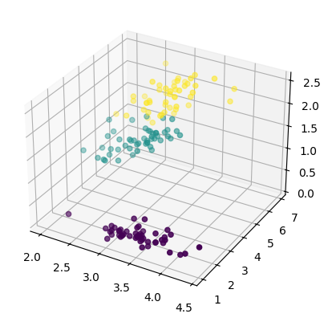

-   **Courbe 3D: `ax.plot(x, y, z)`**

    Une courbe 3D peut être utile pour montrer l'évolution d'une valeur dans l'espace.

    ```python
    # Données pour une courbe hélicoïdale
    theta = np.linspace(-4 * np.pi, 4 * np.pi, 100)
    z = np.linspace(-2, 2, 100)
    x = np.sin(theta)
    y = np.cos(theta)

    # Création de la figure et de l'axe 3D
    fig = plt.figure()
    ax = fig.add_subplot(111, projection='3d')

    # Courbe 3D
    ax.plot(x, y, z, label='Courbe hélicoïdale')
    ax.set_xlabel('X')
    ax.set_ylabel('Y')
    ax.set_zlabel('Z')
    ax.legend()
    plt.show()
    ```

    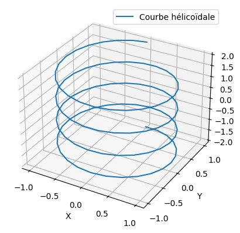

-   **Surface 3D: `ax.plot_surface(X,Y,Z)`**

    Une surface 3D (`surface plot`) peut être utilisée pour représenter une fonction à deux variables.

    ```python
    import numpy as np
    from mpl_toolkits.mplot3d import Axes3D
    f = lambda x,y : np.sin(x) + np.cos(x+y)*np.cos(x)
    X = np.linspace(0,5,100)
    Y = np.linspace(0,5,100)
    X,Y = np.meshgrid(X,Y)
    Z = f(X,Y)
    ax =plt.axes(projection='3d')
    ax.plot_surface(X,Y,Z,cmap="plasma")
    ```

    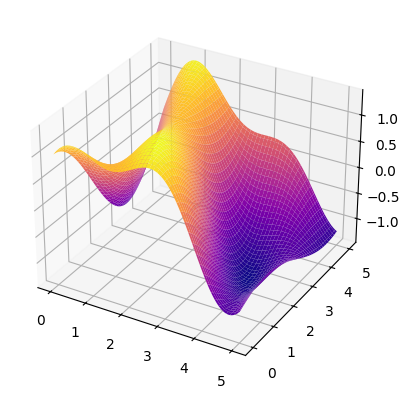

### RQ : la fonction : **`np.meshgrid`**

-   La fonction `np.meshgrid` de la bibliothèque `NumPy` est utilisée pour créer des matrices de coordonnées à partir de deux vecteurs 1D, ce qui est particulièrement utile pour le traçage en 3D et le calcul sur des grilles. Elle permet de générer un maillage cartésien qui peut être utilisé pour évaluer des fonctions sur une grille 2D ou 3D.

-   **Syntaxe:**

    ```python
    X, Y = np.meshgrid(x, y)
    ```

    -   La fonction retourne deux tableaux 2D, chacun de la même taille que la grille définie par `x` et `y`. `X` contient les répétitions de `x` dans chaque colonne, et `Y` contient les répétitions de `y` dans chaque ligne.

-   **Exemple:**

    ```python
    x = np.array([1, 2, 3])
    y = np.array([4, 5])

    X, Y = np.meshgrid(x, y)
    print("X:\n", X)
    print("Y:\n", Y)
    ```

    ```
    X:
    [[1 2 3]
    [1 2 3]]
    Y:
    [[4 4 4]
    [5 5 5]]
    ```

    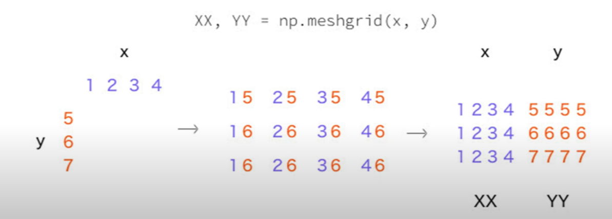

## 3. **Graphiques Histogrammes:**

> Les histogrammes sont des graphiques utilisés pour représenter la distribution des données. Ils regroupent les données en **classes** (ou **buckets** ou **bins**) et comptent le nombre d'observations dans chaque classe. Avec `matplotlib`, on utilise `plt.hist` pour des histogrammes 1D et `plt.hist2d` pour des histogrammes en deux dimensions.

### 3.1 **Histogramme 1D avec `plt.hist`:**

-   L’histogramme 1D représente la fréquence des données en une seule dimension.

-   **Syntaxe de `plt.hist`:**

    ```python
    plt.hist(x, bins=None, range=None, density=False, weights=None, cumulative=False, color=None, alpha=None, label=None)
    ```

    -   **x** : Les données à analyser, sous forme de liste ou de tableau.
    -   **bins** : Le nombre de classes (ou leur taille) pour regrouper les données. Peut être un entier (nombre de classes) ou une liste définissant explicitement les limites des classes.
    -   **range** : Une paire (min, max) pour limiter les valeurs sur l’axe des x.
    -   **density** : Si `True`, normalise l'histogramme pour représenter la densité de probabilité (la somme de toutes les classes sera égale à 1).
    -   **weights** : Les poids associés aux données. Permet de donner plus d'importance à certaines valeurs.
    -   **cumulative** : Si `True`, affiche un histogramme cumulé.
    -   **color** : Couleur de l'histogramme.
    -   **alpha** : Transparence des barres (entre 0 et 1).
    -   **label** : Étiquette de l'histogramme pour la légende.

-   **Exemple d'utilisation:**

    ```python
    import matplotlib.pyplot as plt
    import numpy as np

    # Génération de données
    data = np.random.randn(1000)

    # Création de l'histogramme
    plt.hist(data, bins=30, color='blue', alpha=0.7, edgecolor='black', density=True)
    plt.xlabel('Valeurs')
    plt.ylabel('Fréquence')
    plt.title('Histogramme 1D')
    plt.show()
    ```

    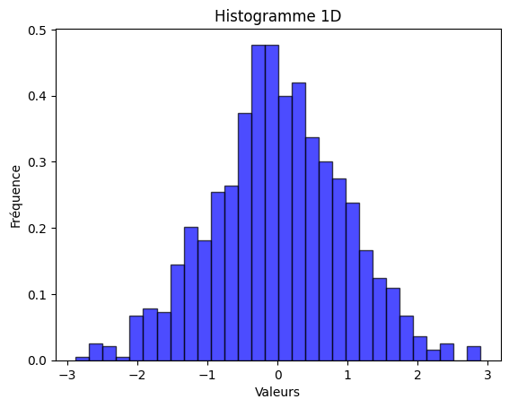

### 3.2. **Histogramme 2D avec `plt.hist2d`:**

-   Un histogramme 2D représente la distribution jointe de deux variables en utilisant une grille 2D de cases, où chaque case montre la fréquence des observations dans cette région.

-   **Syntaxe de `plt.hist2d`:**

    ```python
    plt.hist2d(x, y, bins=(nb_bins_x, nb_bins_y), range=None, density=False, cmap=None)
    ```

    -   **x, y** : Les données en deux dimensions.
    -   **bins** : Nombre de classes pour chaque axe (x et y). Peut être un entier ou un tuple `(nb_bins_x, nb_bins_y)`.
    -   **range** : Une paire `(range_x, range_y)` pour limiter les valeurs des axes x et y.
    -   **density** : Si `True`, normalise les valeurs pour qu’elles représentent une densité.
    -   **cmap** : La colormap utilisée pour les couleurs, comme `'viridis'`, `'plasma'`, etc.

-   **Exemple d'utilisation**

    ```python
    # Données en deux dimensions
    x = np.random.randn(1000)
    y = np.random.randn(1000)

    # Création de l'histogramme 2D
    plt.hist2d(x, y, bins=(30, 30), cmap='Blues')
    plt.colorbar()  # Ajout d'une barre de couleur
    plt.xlabel('X')
    plt.ylabel('Y')
    plt.title('Histogramme 2D')
    plt.show()
    ```

    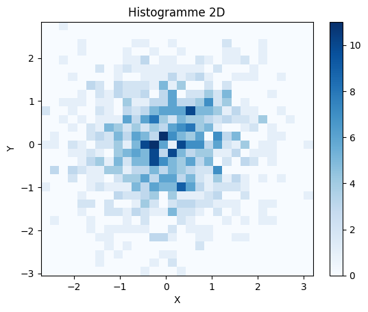

### RQ : **Comparaison entre `plt.hist` et `plt.hist2d`**

-   **`plt.hist`** : Utile pour analyser la distribution d'une seule variable.
-   **`plt.hist2d`** : Utile pour examiner la distribution conjointe de deux variables, où les couleurs représentent la fréquence des observations dans chaque région.

Ces deux fonctions offrent un aperçu efficace de la répartition des données et permettent d’identifier des patterns ou anomalies dans les distributions.

## 4. **contour plot:**

-   **Description:**

    -   une ligne de niveau (contour) représente tous les points (𝑥,𝑦) pour lesquels la valeur de 𝑧 = f(x,y) est constante

    -   Les **contour plots** (ou courbes de niveau) sont des graphiques utilisés pour représenter une fonction en deux dimensions. Ils montrent des lignes de contour, où chaque ligne représente un niveau constant de la fonction. Les zones délimitées par ces lignes peuvent être colorées pour indiquer différentes valeurs de la fonction.

-   **`plt.contour`:**

    ```python
    plt.contour(X, Y, Z, levels=None, colors=None cmap=None)
    ```

    -   **X, Y** : Coordonnées de la grille, créées généralement avec `np.meshgrid`.
    -   **Z** : Fonction ou matrice de valeurs représentant les hauteurs pour chaque paire `(X, Y)`.
    -   **levels** : Nombre ou liste des niveaux de contour à afficher.
    -   **colors** : Couleur des lignes de contour. Peut être une couleur unique ou une liste de couleurs.
    -   **cmap** : Palette de couleurs pour les niveaux si `colors` n’est pas spécifié.

    ```python
    f = lambda x,y : np.sin(x) + np.cos(x+y)*np.cos(x)
    X = np.linspace(0,5,100)
    Y = np.linspace(0,5,100)
    X,Y = np.meshgrid(X,Y)
    Z = f(X,Y)
    plt.contour(X,Y,Z , 20 , colors="black")
    ```

    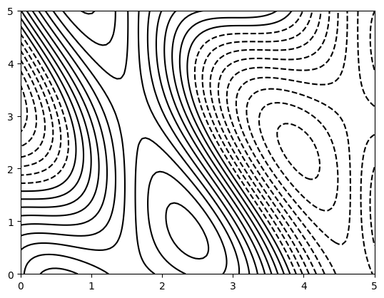

-   **`plt.contourf:`**

    ```python
    plt.contourf(X, Y, Z, levels=None, cmap=None)
    ```

    -   **levels** : Nombre ou liste des niveaux de contour. Si non spécifié, `matplotlib` choisit des niveaux par défaut.
    -   **cmap** : Colormap pour colorier les niveaux entre les lignes de contour. Les colormaps courantes sont `'viridis'`, `'plasma'`, `'coolwarm'`, etc.

    ```python
    f = lambda x,y : np.sin(x) + np.cos(x+y)*np.cos(x)
    X = np.linspace(0,5,100)
    Y = np.linspace(0,5,100)
    X,Y = np.meshgrid(X,Y)
    Z = f(X,Y)
    plt.contourf(X,Y,Z , 30 , cmap="RdGy")
    plt.colorbar()
    ```

    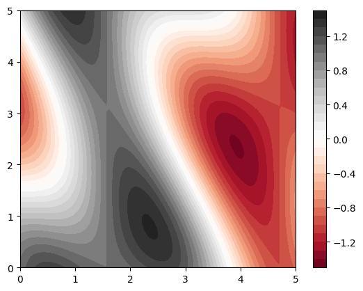

### RQ : **Différence entre `plt.contour` et `plt.contourf`**

-   **`plt.contour`** : Affiche uniquement les lignes de contour, utile pour visualiser la forme de la surface.
-   **`plt.contourf`** : Remplit les régions entre les lignes, avec des couleurs indiquant les valeurs des niveaux, ce qui rend les variations de valeur plus faciles à interpréter visuellement.

Ces deux types de contour plots sont très pratiques pour analyser des fonctions en deux dimensions, particulièrement lorsqu’on veut observer l'évolution d'une variable sans la complexité d'un graphique 3D.

## 5. **Graphique `plt.imshow`:**

-   **Description:**

    > La fonction `plt.imshow()` de Matplotlib est utilisée pour afficher des images, souvent sous forme de matrices ou d'images en niveaux de gris et en couleur, dans un environnement graphique. Elle est particulièrement utile pour visualiser des données matricielles ou des images en utilisant des nuances ou des cartes de couleur.

-   **Syntaxe:**

    ```python
    plt.imshow(Z, cmap='viridis') # avec Z une np.array
    plt.colorbar()  # Ajoute une barre de couleur
    plt.title("Affichage de la matrice avec imshow")
    plt.show()
    ```

-   **Exemple 1:**

    ```python
    f = lambda x,y : np.sin(x) + np.cos(x+y)*np.cos(x)
    X = np.linspace(0,5,100)
    Y = np.linspace(0,5,100)
    X,Y = np.meshgrid(X,Y)
    Z = f(X,Y)
    plt.imshow(Z)
    plt.colorbar()
    ```

    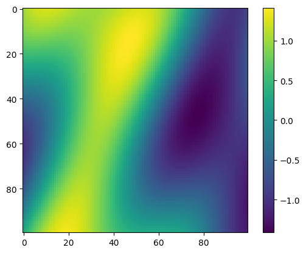

-   **Exemple 2: `matrice de Corrélation`**

    ```python
    from sklearn.datasets import load_iris
    df = load_iris()
    x = df.data
    plt.imshow(np.corrcoef(x.T) , cmap="Blues")
    plt.colorbar()
    ```

    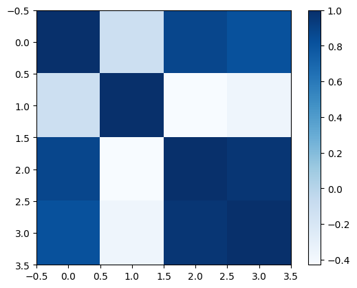
