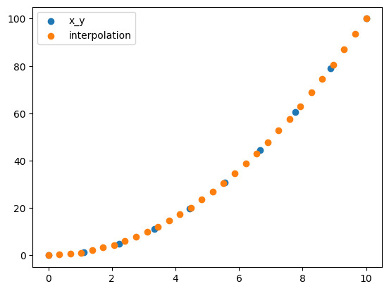
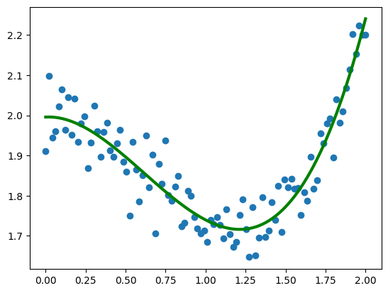
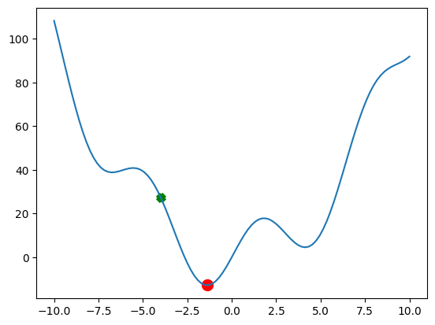
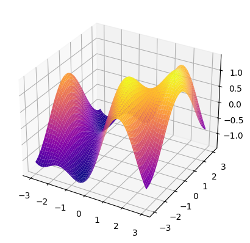
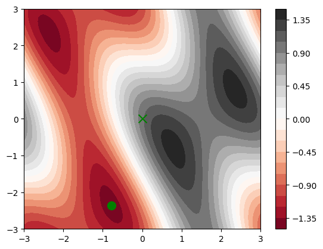

# cour 03 : **scipy:**

## 1. **Interpolation:**

### 1.1 **Definition:**

-   L'interpolation est une méthode en analyse numérique qui permet d'estimer des valeurs intermédiaires d'une fonction, basée sur des points connus. Elle est utilisée pour obtenir une estimation lisse entre des valeurs discrètes.

-   Il existe plusieurs types d'interpolation :

    -   L'interpolation linéaire utilise une ligne droite entre deux points pour estimer les valeurs intermédiaires.

    -   L'interpolation quadratique utilise un polynôme de degré 2 pour estimer les valeurs intermédiaires .

    -   L'interpolation cubique utilise un polynôme de degré 3 pour estimer les valeurs intermédiaires.

### 1.2 **`interp1d`:**

-   La fonction `interp1d` de `scipy.interpolate` est utilisée pour créer une fonction d'interpolation à une dimension à partir de points de données discrets.

-   **Syntaxe:**

    ```python
    from scipy.interpolate import interp1d
    f = interp1d(x, y, kind='linear')
    ```

    -   **`x`** : Les points d'échantillonnage de la variable indépendante. Doit être de type array-like et de taille 1D.
    -   **`y`** : Les valeurs correspondantes de la fonction à interpoler aux points `x`. Peut être multidimensionnel.
    -   **`kind`** : Le type d'interpolation à utiliser (par défaut, `'linear'`). Les options incluent :

        -   `'linear'` : interpolation linéaire.
        -   `'nearest'` : interpolation au plus proche voisin.
        -   `'zero'` : interpolation par morceaux avec valeurs constantes.
        -   `'slinear'` : interpolation linéaire par segments.
        -   `'quadratic'` et `'cubic'` : interpolation quadratique et cubique par segments (fonction splines).

    -   **return:** La fonction `interp1d` renvoie un objet de fonction d'interpolation. Cet objet agit comme une fonction que vous pouvez appeler pour obtenir les valeurs interpolées aux points souhaités.

-   **Exemple:**

    ```python
    from scipy.interpolate import interp1d
    import numpy as np
    import matplotlib.pyplot as plt

    x = np.linspace(0,10 , 10)
    y = x**2

    # Inetrpolation :
    f = interp1d(x,y , kind="linear")


    x_new = np.linspace(0,10 , 30)
    plt.scatter(x,y , label="x_y")
    plt.scatter(x_new , f(x_new) ,label="interpolation")
    plt.legend()
    plt.show()
    ```

    

## 2. **Optimisation:**

### 2.1 **`curve_fit`:**

-   **Description:**

    > La fonction `curve_fit` du module `scipy.optimize` est utilisée pour ajuster une fonction définie par l'utilisateur à un ensemble de données, en effectuant une optimisation non linéaire (régression non linéaire). Elle utilise la méthode des moindres carrés pour estimer les paramètres de la fonction afin de minimiser la différence entre les valeurs prédites et les valeurs observées des données.

-   **Syntaxe:**

    ```python
    from scipy.optimize import curve_fit

    params , prams_cov  = curve_fit(f, xdata, ydata)
    ```

    -   **f** : La fonction modèle que l'on souhaite ajuster aux données. Elle doit être définie par l'utilisateur et doit prendre comme premier argument la variable indépendante, et comme arguments suivants les paramètres à estimer.
    -   **xdata** : Tableau ou liste des valeurs de la variable indépendante (entrées).
    -   **ydata** : Tableau ou liste des valeurs observées de la variable dépendante (sorties).

    -   **params** : Les valeurs optimales des paramètres pour lesquelles la fonction modèle correspond le mieux aux données.
    -   **prams_cov** : La matrice de covariance des paramètres optimaux, qui donne une estimation de l'incertitude des paramètres.

-   **Exemple:**

    ```python
    from scipy.optimize import curve_fit


    def f(x , a, b , c, d) :
        return a* x**3  + b*x**2 + c*x + d


    x_3 = np.linspace(0,2, 100)
    y_3 = 1/3*x_3**3  - 3/5 * x_3**2 + 2  + np.random.randn(x_3.shape[0])/20
    plt.scatter(x_3,y_3)

    params , params_cov = curve_fit(f , x_3 , y_3)

    plt.plot(x_3 , f(x_3 , params[0] , params[1] , params[2] , params[3]) , c='g' , lw=3)
    print(f"f_estime = {params[0]}*x^3 + {params[1]}*x^2 + {params[2]}*x + {params[3]}")
    ```

    

### 2.2 **`minimize`:**

-   **Description:**

    > La fonction `minimize` de `scipy.optimize` est utilisée pour trouver le minimum d'une fonction scalaire. Elle peut résoudre des problèmes d'optimisation non linéaire pour des fonctions à plusieurs variables et propose plusieurs algorithmes d'optimisation, chacun adapté à différents types de problèmes.

-   **Syntaxe:**

    ```python
    from scipy.optimize import minimize

    result = minimize(fun, x0, args=(), method=None)
    ```

    -   **fun** : La fonction objective à minimiser. Elle doit être définie par l'utilisateur et prendre comme premier argument un tableau représentant les variables à optimiser.
    -   **x0** : Point de départ de l'algorithme, qui est un tableau contenant les valeurs initiales des variables.
    -   **args** : Arguments supplémentaires passés à la fonction objective (en plus des variables à optimiser).
    -   **method** : Méthode d’optimisation à utiliser, comme :

        -   `'Nelder-Mead'` (pour les problèmes sans dérivées)
        -   `'BFGS'` (basée sur le gradient)
        -   `'L-BFGS-B'` (méthode BFGS avec des bornes)
        -   `'CG'` (gradient conjugué)

    -   La fonction `minimize` retourne un objet `OptimizeResult`, qui contient plusieurs attributs :

        -   **x** : Le point optimal trouvé par l'algorithme.
        -   **fun** : La valeur de la fonction au point optimal.
        -   **success** : Booléen indiquant si l'optimisation a convergé.
        -   **message** : Message d'état indiquant si l'optimisation s'est bien déroulée.
        -   **nfev** et **njev** : Nombre d’évaluations de la fonction et du gradient.

-   **Exemple 1:**

    ```python
    from scipy.optimize import minimize

    def g(x) :
        return x**2 + 15*np.sin(x)

    x_0 = - 4
    x_optim = minimize(g , x0=x_0).x
    print(x_optim)


    x = np.linspace(-10 , 10 , 100)
    plt.plot(x , g(x))
    plt.scatter(x_0 , g(x_0) , c='g' , marker='x' , lw=5)
    plt.scatter(x_optim , g(x_optim) , c='r' , marker='o' , lw=5)
    ```

    

-   **Exemple 2:**

    ```python
    from mpl_toolkits.mplot3d import Axes3D

    def f(x) :
        return np.sin(x[0]) + np.cos(x[0]+x[1])*np.cos(x[0])

    x0 = np.array([0 , 0])
    res = minimize(f , x0=x0).x


    # ========== affichage 3D  : =========
    ax = plt.axes(projection='3d')
    x= np.linspace(-3,3,100)
    y= np.linspace(-3,3 , 100)
    x,y = np.meshgrid(x,y)
    z = f(np.array([x,y]))
    ax.plot_surface(x,y,z , cmap='plasma')
    # ============ affichage des lignes des niveaux : ======
    plt.contourf(x,y,z ,20 , cmap="RdGy")
    plt.colorbar()
    plt.scatter(x0[0] , x0[1] , marker='x' , c='g', s=100)
    plt.scatter(res[0] , res[1] , marker='o' , c='g', s=100)


    ```

    

    
