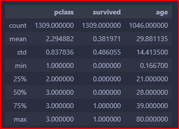
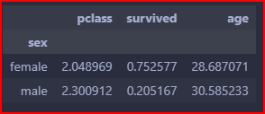
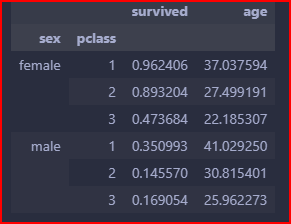

# cour 03 : **Analyse des données**

## 1 **exploration du DataFrame:**

-   L'analyse de données avec Pandas commence souvent par une exploration initiale du DataFrame pour comprendre sa structure et ses caractéristiques de base. Voici les méthodes couramment utilisées pour obtenir des résumés et des aperçus des données :

| **Nom**      | **Définition**                                                                  | **Syntaxe**                 |
| ------------ | ------------------------------------------------------------------------------- | --------------------------- |
| `head()`     | Affiche les premières lignes du DataFrame (5 par défaut).                       | `df.head(n=5)`              |
| `tail()`     | Affiche les dernières lignes du DataFrame (5 par défaut).                       | `df.tail(n=5)`              |
| `describe()` | Génère des statistiques descriptives pour les colonnes numériques.              | `df.describe(include=None)` |
| `shape`      | Renvoie la dimension du DataFrame sous la forme `(nombre de lignes, colonnes)`. | `df.shape`                  |
| `columns`    | est utilisé pour afficher ou accéder aux noms des colonnes d'un DataFrame..     | `df.columns`                |

-   **Exemple :**

```python
import pandas as pd
df = pd.read_excel("./titanic.xls")
df.head()
df.shape
df.columns
df.describe()
```



## 2 **modification du DataFrame:**

### 2.1 **La méthode `drop()`:**

-   **Definition:**

    > La méthode **`drop()`** de Pandas est utilisée pour supprimer des lignes ou des colonnes d'un DataFrame. Elle est utile pour éliminer des données non pertinentes ou pour nettoyer un DataFrame avant analyse.

-   **Syntaxe:**

    ```python
    # Pour supprimer des colonnes
    df.drop(labels, axis=1, inplace=False)

    # Pour supprimer des lignes
    df.drop(labels, axis=0, inplace=False)
    ```

    -   **`labels`** : Nom(s) des colonnes ou index des lignes à supprimer.
    -   **`axis`** : Spécifie si l'on supprime des colonnes (1) ou des lignes (0).
    -   **`inplace`** : Si `True`, la suppression est faite directement sur le DataFrame sans retourner une copie (par défaut, `False`).

-   **Exemple 1 : Supprimer une colonne**

    ```python
    import pandas as pd

    # Création d'un DataFrame pour l'exemple
    data = {
        'Nom': ['Alice', 'Bob', 'Charlie'],
        'Âge': [25, 30, 35],
        'Ville': ['Paris', 'Lyon', 'Marseille']
    }
    df = pd.DataFrame(data)

    # Supprimer la colonne 'Ville'
    df_sans_ville = df.drop('Ville', axis=1)
    print("DataFrame sans la colonne 'Ville' :")
    print(df_sans_ville)
    ```

-   **Exemple 2 : Supprimer une ligne**

    ```python
    # Supprimer la ligne avec l'index 1
    df_sans_bob = df.drop(1, axis=0)
    print("\nDataFrame sans la ligne avec l'index 1 (Bob) :")
    print(df_sans_bob)
    ```

### 2.2 **ajouter une colonne:**

-   **Définition:**

    > Pour ajouter une colonne, vous pouvez simplement attribuer une série ou une liste à un nouveau nom de colonne dans le DataFrame.

-   **Syntaxe:**

    ```python
    df['nouvelle_colonne'] = valeur  # valeur peut être une liste, une série, ou une valeur scalaire
    ```

-   **Exemple:**

    ```python
    import pandas as pd

    # Création d'un DataFrame pour l'exemple
    data = {
        'Nom': ['Alice', 'Bob', 'Charlie'],
        'Âge': [25, 30, 35]
    }
    df = pd.DataFrame(data)

    # Ajouter une nouvelle colonne 'Ville'
    df['Ville'] = ['Paris', 'Lyon', 'Marseille']
    print("DataFrame après ajout de la colonne 'Ville' :")
    print(df)
    ```

## 3. **Analyse des données catégorielles:**

### 3.1 **La méthode **`value_counts()`**:**

-   **Définition:**

    > La méthode **`value_counts()`** de Pandas est utilisée pour compter le nombre d'occurrences de chaque valeur unique dans une colonne d'un DataFrame ou dans une série. Cette méthode est particulièrement utile pour explorer et analyser des données catégorielles.

    -   **`value_counts()`** renvoie une série contenant les valeurs uniques comme index et le nombre de leurs occurrences comme valeurs. Les résultats sont triés par défaut par fréquence décroissante.

-   **Syntaxe:**

    ```python
    df["col"].value_counts(normalize=False, sort=True, ascending=False, bins=None, dropna=True)
    ```

    -   **`normalize`** : Si `True`, renvoie les fréquences relatives plutôt que les comptes bruts.
    -   **`sort`** : Si `True`, les résultats sont triés par fréquence (par défaut).
    -   **`ascending`** : Si `True`, trie par ordre croissant.
    -   **`bins`** : Si un entier est spécifié, divise les données en intervalles (bins).
    -   **`dropna`** : Si `True`, exclut les valeurs `NaN` du comptage.

-   **Exemple:**

    ```python
    import pandas as pd

    # Création d'un DataFrame pour l'exemple
    data = {
        'Nom': ['Alice', 'Bob', 'Charlie', 'David', 'Alice', 'Bob', 'Alice'],
        'Ville': ['Paris', 'Lyon', 'Marseille', 'Toulouse', 'Paris', 'Lyon', 'Paris']
    }
    df = pd.DataFrame(data)

    # Compter les occurrences des noms
    nombre_noms = df['Nom'].value_counts()
    print("Occurrences des noms :")
    print(nombre_noms)

    # Compter les occurrences des villes
    nombre_villes = df['Ville'].value_counts()
    print("\nOccurrences des villes :")
    print(nombre_villes)
    ```

    ```
    Occurrences des noms :
    Alice      3
    Bob        2
    Charlie    1
    David      1
    Name: Nom, dtype: int64

    Occurrences des villes :
    Paris        3
    Lyon         2
    Marseille    1
    Toulouse     1
    Name: Ville, dtype: int64
    ```

### 3.2 **La méthode **`groupby()`**:**

-   **Définition:**

    > La méthode **`groupby()`** de Pandas est utilisée pour regrouper des données en fonction d'une ou plusieurs colonnes. Cela permet d'effectuer des opérations d'w, de transformation ou de filtrage sur les groupes de données. C'est un outil puissant pour l'analyse de données, car il permet de résumer et de manipuler des ensembles de données complexes.

    -   **`groupby()`** crée un objet `GroupBy` qui peut être utilisé pour appliquer des fonctions d'agrégation (comme `sum`, `mean`, `count`, etc.) sur chaque groupe. Les résultats peuvent être retournés sous forme de DataFrame ou de série.

-   **Syntaxe:**

    ```python
    df.groupby(by)
    ```

    -   **`by`** : Colonne(s) ou liste de colonnes selon lesquelles regrouper.

-   **Exemple:**

```python
# en peu d'analyse :

# nombres des personnes dans chanque classe :
df["pclass"].value_counts()

# Group by : La moyenne des fammes ayant survécu

df.groupby("sex").mean()


# moyenne_femmes_survécu = df[(df["sex"] == "female") ]["survived"].mean()
# moyenne_femmes_survécu # 0.7525773195876289

# Group by : La moyenne des fammes ayant survécu par classe

df.groupby(["sex" , "pclass"]).mean()

```




