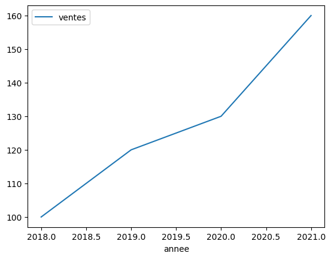
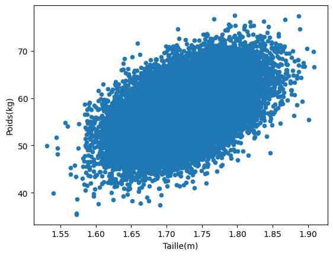
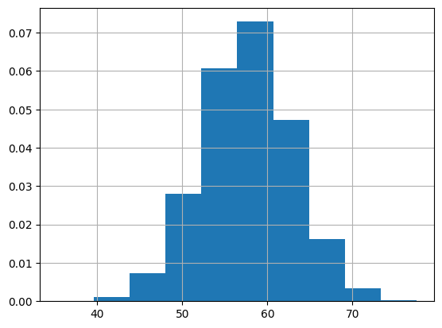

# cour 05 : **plot**

## 1. **`plot()` :**

-   **Description** :

    > La méthode `plot()` de `pandas` est utilisée pour tracer différents types de graphiques en fonction du type de données. Par défaut, elle crée un graphique en ligne (ou "line plot"), ce qui est utile pour représenter des séries temporelles ou des données continues.

-   **Syntaxe** :

    ```python
    DataFrame.plot(kind='line', x=None, y=None)
    ```

    -   **kind** : Type de graphique, comme `'line'`, `'bar'`, `'hist'`, `'scatter'`, etc.
    -   **x** : Colonne à utiliser pour les valeurs de l'axe X (si applicable).
    -   **y** : Colonne à utiliser pour les valeurs de l'axe Y (si applicable).

-   **Exemple** :

    ```python
    import pandas as pd
    import matplotlib.pyplot as plt

    df = pd.DataFrame({
        'annee': [2018, 2019, 2020, 2021],
        'ventes': [100, 120, 130, 160]
    })
    df.plot(x='annee', y='ventes', kind='line')
    plt.show()
    ```

    

## 2. **`plot.scatter()` :**

-   **Description** :

    > La méthode `plot.scatter()` permet de créer un graphique de type nuage de points ("scatter plot"), idéal pour visualiser la relation entre deux variables continues.

-   **Syntaxe** :

    ```python
    DataFrame.plot.scatter(x, y, s=None, c=None)
    ```

    -   **x** : Colonne à utiliser pour les valeurs de l'axe X.
    -   **y** : Colonne à utiliser pour les valeurs de l'axe Y.
    -   **s** : Taille des points (peut être une constante ou une colonne de DataFrame).
    -   **c** : Couleur des points (peut être une constante ou une colonne de DataFrame).

-   **Exemple** :

    ```python
    df_tp = pd.read_csv("./SOCR-HeightWeight.csv")

    df_tp.drop(['Index'] , axis=1  , inplace=True)
    df_tp['Height(Inches)'] = df_tp['Height(Inches)']*0.0254
    df_tp['Weight(Pounds)'] = df_tp['Weight(Pounds)']*0.453592
    df_tp.columns = ["Taille(m)" ,"Poids(kg)"]

    df_tp.plot.scatter(x="Taille(m)" , y = "Poids(kg)")
    ```

    

## 3. **`plot.bar()` :**

-   **Description** : La méthode `plot.bar()` génère un graphique en barres verticales, utile pour afficher et comparer des quantités discrètes.

-   **Syntaxe** :

    ```python
    DataFrame.plot.bar(x=None, y=None, **kwargs)
    ```

    -   **x** : Colonne à utiliser pour les catégories sur l'axe X.
    -   **y** : Colonne(s) à utiliser pour la hauteur des barres.

-   **Exemple** :

    ```python
    df = pd.DataFrame({
        'produit': ['A', 'B', 'C', 'D'],
        'ventes': [20, 35, 30, 35]
    })
    df.plot.bar(x='produit', y='ventes')
    plt.show()
    ```

## 4. **`hist()` :**

-   **Description** :

    > La méthode `hist()` crée un histogramme, qui est utile pour visualiser la distribution d'une variable numérique.

-   **Syntaxe** :

    ```python
    DataFrame.hist(bins=10, density=True)
    ```

    -   **bins** : Nombre de classes pour l'histogramme.

-   **Exemple** :

    ```python
    # distrubition du poids

    df_tp["Poids(kg)"].hist(density=True)
    ```

    
