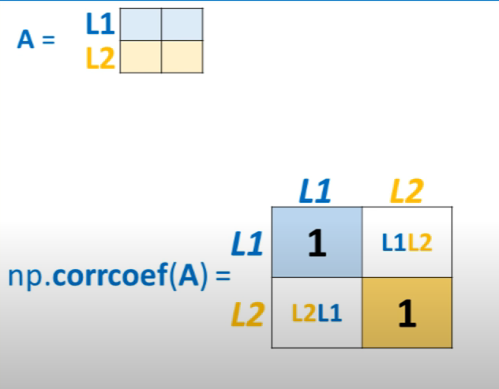

# cour 05 : **statistique avce numpy:**

## 1. **`mean` , `std` et `var`:**

### 1.1 **`mean():`**

-   **Description :**

    > La méthode `mean` de NumPy est utilisée pour calculer la moyenne des éléments d'un tableau NumPy le long d'un axe spécifié ou de tous les éléments si aucun axe n'est spécifié.

-   **Syntaxe (avec axis) :**

    ```python
    numpy.mean(a, axis=None)
    ```

    -   `a` : Tableau NumPy pour lequel la moyenne doit être calculée.
    -   `axis` : Spécifie l'axe le long duquel la moyenne doit être calculée. Par défaut, la moyenne est calculée sur tous les éléments du tableau.

-   **Exemple :**

    ```python
    import numpy as np

    # Création d'un tableau NumPy
    arr = np.array([[1, 2, 3],
                    [4, 5, 6]])

    # Calcul de la moyenne de tous les éléments
    moyenne_totale = np.mean(arr)

    # Calcul de la moyenne le long de l'axe 0 (par colonne)
    moyenne_par_colonne = np.mean(arr, axis=0)

    # Calcul de la moyenne le long de l'axe 1 (par ligne)
    moyenne_par_ligne = np.mean(arr, axis=1)

    print("Tableau original :")
    print(arr)
    print("\nMoyenne totale des éléments du tableau :", moyenne_totale)
    print("Moyenne par colonne :", moyenne_par_colonne)
    print("Moyenne par ligne :", moyenne_par_ligne)
    ```

    -   **Output :**

        ```
        Tableau original :
        [[1 2 3]
         [4 5 6]]

        Moyenne totale des éléments du tableau : 3.5
        Moyenne par colonne : [2.5 3.5 4.5]
        Moyenne par ligne : [2. 5.]
        ```

### 1.2 **`std():`**

-   **Description :**

    > La méthode `std` de NumPy est utilisée pour calculer l'écart-type des éléments d'un tableau NumPy. L'écart-type mesure la dispersion des valeurs autour de la moyenne. Il peut être calculé le long d'un axe spécifié ou pour tous les éléments.

-   **Syntaxe (avec axis) :**

    ```python
    numpy.std(a, axis=None)
    ```

    -   `a` : Tableau NumPy pour lequel l'écart-type doit être calculé.
    -   `axis` : Spécifie l'axe le long duquel l'écart-type doit être calculé. Par défaut, l'écart-type est calculé sur tous les éléments du tableau.

-   **Exemple :**

    ```python
    import numpy as np

    # Création d'un tableau NumPy
    arr = np.array([[1, 2, 3],
                    [4, 5, 6]])

    # Calcul de l'écart-type de tous les éléments
    ecart_type_total = np.std(arr)

    # Calcul de l'écart-type le long de l'axe 0 (par colonne)
    ecart_type_par_colonne = np.std(arr, axis=0)

    # Calcul de l'écart-type le long de l'axe 1 (par ligne)
    ecart_type_par_ligne = np.std(arr, axis=1)

    print("Tableau original :")
    print(arr)
    print("\nÉcart-type total des éléments du tableau :", ecart_type_total)
    print("Écart-type par colonne :", ecart_type_par_colonne)
    print("Écart-type par ligne :", ecart_type_par_ligne)
    ```

    -   **Output :**

        ```
        Tableau original :
        [[1 2 3]
         [4 5 6]]

        Écart-type total des éléments du tableau : 1.707825127659933
        Écart-type par colonne : [1.5 1.5 1.5]
        Écart-type par ligne : [0.81649658 0.81649658]
        ```

### 1.3 **`var():`**

-   **Description :**

    > La méthode `var` de NumPy est utilisée pour calculer la variance des éléments d'un tableau NumPy. La variance mesure la dispersion des données. Elle peut être calculée le long d'un axe spécifié ou pour tous les éléments.

-   **Syntaxe (avec axis) :**

    ```python
    numpy.var(a, axis=None)
    ```

    -   `a` : Tableau NumPy pour lequel la variance doit être calculée.
    -   `axis` : Spécifie l'axe le long duquel la variance doit être calculée. Par défaut, la variance est calculée sur tous les éléments du tableau.

-   **Exemple :**

    ```python
    import numpy as np

    # Création d'un tableau NumPy
    arr = np.array([[1, 2, 3],
                    [4, 5, 6]])

    # Calcul de la variance de tous les éléments
    variance_totale = np.var(arr)

    # Calcul de la variance le long de l'axe 0 (par colonne)
    variance_par_colonne = np.var(arr, axis=0)

    # Calcul de la variance le long de l'axe 1 (par ligne)
    variance_par_ligne = np.var(arr, axis=1)

    print("Tableau original :")
    print(arr)
    print("\nVariance totale des éléments du tableau :", variance_totale)
    print("Variance par colonne :", variance_par_colonne)
    print("Variance par ligne :", variance_par_ligne)
    ```

    -   **Output :**

        ```
        Tableau original :
        [[1 2 3]
         [4 5 6]]

        Variance totale des éléments du tableau : 2.9166666666666665
        Variance par colonne : [2.25 2.25 2.25]
        Variance par ligne : [0.66666667 0.66666667]
        ```

## 2. **`corrcoef():`**

-   **Description :**

    > La méthode `corrcoef` de NumPy est utilisée pour calculer la matrice de corrélation entre plusieurs variables. La corrélation mesure l'intensité et la direction de la relation linéaire entre deux ensembles de données. La matrice de corrélation montre les coefficients de corrélation entre chaque paire de variables.

-   **Syntaxe :**

    ```python
    numpy.corrcoef(x, y=None, rowvar=True)
    ```

    -   `x` : Tableau d'entrée contenant les variables pour lesquelles la matrice de corrélation doit être calculée. Si `y` n'est pas fourni, `x` est supposé contenir les différentes séries de données dans ses colonnes (si `rowvar=False`).
    -   `y` : (optionnel) Un autre tableau de variables à comparer à `x`.
    -   `rowvar` : Si `True`, chaque ligne représente une variable et chaque colonne une observation. Si `False`, les colonnes représentent les variables et les lignes les observations. Par défaut, `True`.

    

-   **Exemple :**

    ```python
    import numpy as np

    # Création de deux séries de données
    x = np.array([1, 2, 3, 4, 5])
    y = np.array([10, 9, 2, 6, 4])

    # Calcul de la matrice de corrélation entre x et y
    corr_matrix = np.corrcoef(x, y)

    print("Séries de données :")
    print("x :", x)
    print("y :", y)
    print("\nMatrice de corrélation :")
    print(corr_matrix)
    ```

    -   **Output :**

        ```
        Séries de données :
        x : [1 2 3 4 5]
        y : [10  9  2  6  4]

        Matrice de corrélation :
        [[ 1.         -0.74261066]
         [-0.74261066  1.        ]]
        ```

    > **Interprétation** :
    >
    > -   La diagonale de la matrice est toujours égale à `1`, car il s'agit de la corrélation d'une variable avec elle-même.
    > -   Le coefficient de corrélation entre `x` et `y` est de `-0.7426`, ce qui indique une relation inverse modérément forte entre les deux variables.

-   **Exemple avec plusieurs variables :**

    ```python
    import numpy as np

    # Création d'un tableau de plusieurs variables
    data = np.array([[1, 2, 3, 4, 5],
                     [10, 9, 2, 6, 4],
                     [5, 4, 2, 8, 7]])

    # Calcul de la matrice de corrélation entre toutes les variables
    corr_matrix_multi = np.corrcoef(data)

    print("Tableau de données :")
    print(data)
    print("\nMatrice de corrélation :")
    print(corr_matrix_multi)
    ```

    -   **Output :**

        ```
        Tableau de données :
        [[ 1  2  3  4  5]
         [10  9  2  6  4]
         [ 5  4  2  8  7]]

        Matrice de corrélation :
        [[ 1.         -0.74261066 -0.12015762]
         [-0.74261066  1.          0.5838156 ]
         [-0.12015762  0.5838156   1.        ]]
        ```

    > **Interprétation** :
    > La matrice de corrélation montre les coefficients entre chaque paire de variables. Plus la valeur est proche de `1` (ou `-1`), plus la corrélation est forte.

## 3. **`unique():`**

-   **Description :**

    > La méthode `unique` de NumPy est utilisée pour trouver les éléments uniques d'un tableau, c'est-à-dire les valeurs qui apparaissent au moins une fois. Elle peut également renvoyer des informations supplémentaires, comme le nombre d'occurrences de chaque élément et leurs indices.

-   **Syntaxe :**

    ```python
    numpy.unique(ar, return_index=False, return_inverse=False, return_counts=False, axis=None)
    ```

    -   `ar` : Tableau d'entrée pour lequel les valeurs uniques doivent être trouvées.
    -   `return_index` : Si `True`, renvoie les indices des premières occurrences des éléments uniques dans le tableau original.
    -   `return_inverse` : Si `True`, renvoie un tableau pour reconstruire le tableau d'origine à partir des éléments uniques.
    -   `return_counts` : Si `True`, renvoie le nombre d'occurrences de chaque élément unique.
    -   `axis` : Si spécifié, trouve les éléments uniques le long de cet axe particulier.

-   **Exemple :**

    ```python
    import numpy as np

    # Création d'un tableau NumPy avec des éléments répétés
    arr = np.array([1, 2, 2, 4, 5 ,5 , 5 , 1 , 4 , 10])

    # Trouver les éléments uniques
    values , counts = np.unique(arr , return_counts = True)
    values[counts.argsort()] # Return arr qui contient au 1ere l'élément qui apparaît le mois , ..etc
    for i ,j in zip(values[counts.argsort()] , counts[counts.argsort()]) :
        print(f"valeur {i} apparait {j} fois .")
    ```
