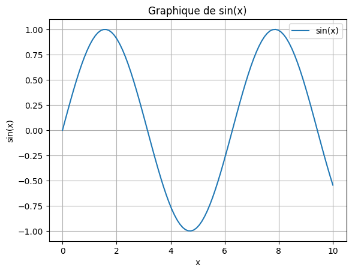

# cour 01 : **Introduction**

-   **Defintion:**

    > Matplotlib est une bibliothèque de visualisation de données en Python qui permet de créer des graphiques 2D de manière simple et flexible. C’est l’une des bibliothèques les plus populaires pour la visualisation de données en Python et est souvent utilisée avec des bibliothèques de traitement de données comme NumPy et pandas.

-   **Utilisation:**

    1.  **Installation** : Vous pouvez installer Matplotlib en utilisant pip :

        ```bash
        pip install matplotlib
        ```

    2.  **Importation** : Pour utiliser Matplotlib, commencez par l'importer :

        ```python
        import matplotlib.pyplot as plt
        import numpy as np
        ```

    3.  **Création d'un graphique simple** : Voici comment créer un graphique linéaire basique :

        ```python
        # Données
        x = np.linspace(0, 10, 100)  # 100 points entre 0 et 10
        y = np.sin(x)  # Sinus des points

        # Création du graphique
        plt.plot(x, y, label='sin(x)')
        plt.title('Graphique de sin(x)')
        plt.xlabel('x')
        plt.ylabel('sin(x)')
        plt.legend()
        plt.grid()
        plt.show()
        plt.savefig('graphique.png')
        ```

    
