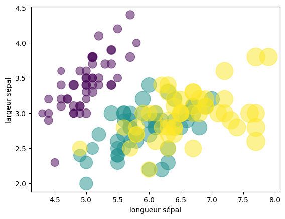
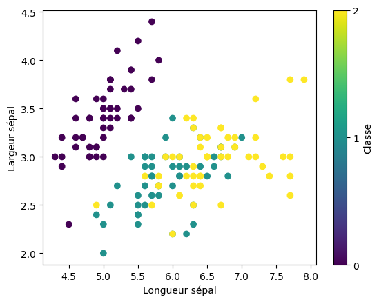

# Cour  : **Graphique de Classification:**

-   **Description:**

    -   Ce graphique montre la séparation entre les classes en fonction de certaines caractéristiques.

    -   Pour deux caractéristiques, par exemple, chaque point représente un échantillon et est coloré selon sa classe. La frontière de décision est la ligne ou la zone où le modèle sépare les classes

-   **Syntaxe :**

    ```python
    plt.scatter(x, y, s=None, c=None, cmap=None, alpha=None)
    ```

    -   **x** : Coordonnées en abscisse des points (tableau ou liste).
    -   **y** : Coordonnées en ordonnée des points (tableau ou liste).
    -   **s** : Taille des points. Peut être un nombre unique ou une liste pour des tailles différentes.
    -   **c** : Couleurs des points. Peut être un nom de couleur, une liste de couleurs, ou un tableau pour représenter une variable catégorielle ou continue.
    -   **cmap** : Colormap à utiliser si `c` est une variable numérique.
    -   **alpha** : Transparence des points (valeur entre 0 et 1).

-   **Exemple d'utilisation:**

    ```python
    import numpy as np
    import matplotlib.pyplot as plt
    from sklearn.datasets import load_iris
    df = load_iris()
    x = df.data
    y = df.target

    plt.scatter(x[:,0] , x[:,1] , c=y , alpha=0.5 , s=x[:,2]*100)
    plt.xlabel("longueur sépal")
    plt.ylabel("largeur sépal ")
    ```

    

    ```python
    plt.scatter(x[:, 0], x[:, 1], c=y, cmap='viridis')
    plt.xlabel("Longueur sépal")
    plt.ylabel("Largeur sépal")
    plt.colorbar(ticks=np.unique(y), label="Classe")
    plt.show()

    ```

    
    


