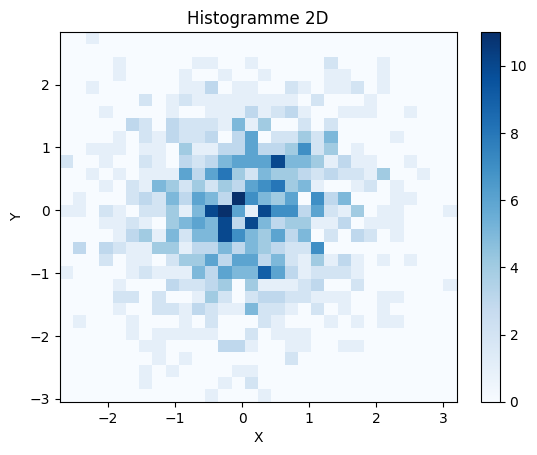

# Cour  **Graphiques Histogrammes:**


## 1 . **Histogramme 1D avec `plt.hist`:**

- **Définition:**

    > Les histogrammes sont des graphiques utilisés pour représenter la distribution des données. Ils regroupent les données en **classes** (ou **buckets** ou **bins**) et comptent le nombre d'observations dans chaque classe. Avec `matplotlib`, on utilise `plt.hist` pour des histogrammes 1D et `plt.hist2d` pour des histogrammes en deux dimensions.

    -   L’histogramme 1D représente la fréquence des données en une seule dimension.

-   **Syntaxe de `plt.hist`:**

    ```python
    plt.hist(x, bins=None, density=False,  color=None , label=None)
    ```

    -   **x** : Les données à analyser, sous forme de liste ou de tableau.
    -   **bins** : Le nombre de classes (ou leur taille) pour regrouper les données. 
    -   **density** : Si `True`, normalise l'histogramme pour représenter la densité de probabilité (la somme de toutes les classes sera égale à 1).
    -   **color** : Couleur de l'histogramme.
    -   **label** : Étiquette de l'histogramme pour la légende.

-   **Exemple d'utilisation:**

    ```python
    import matplotlib.pyplot as plt
    import numpy as np

    # Génération de données
    data = np.random.randn(1000)

    # Création de l'histogramme
    plt.hist(data, bins=30, color='blue', alpha=0.7, edgecolor='black', density=True)
    plt.xlabel('Valeurs')
    plt.ylabel('Fréquence')
    plt.title('Histogramme 1D')
    plt.show()
    ```

    

## 2.**Histogramme 2D avec `plt.hist2d`:**

-   Un histogramme 2D représente la distribution jointe de deux variables en utilisant une grille 2D de cases, où chaque case montre la fréquence des observations dans cette région.

-   **Syntaxe de `plt.hist2d`:**

    ```python
    plt.hist2d(x, y, bins=(nb_bins_x, nb_bins_y), range=None, density=False, cmap=None)
    ```

    -   **x, y** : Les données en deux dimensions.
    -   **bins** : Nombre de classes pour chaque axe (x et y). Peut être un entier ou un tuple `(nb_bins_x, nb_bins_y)`.
    -   **range** : Une paire `(range_x, range_y)` pour limiter les valeurs des axes x et y.
    -   **density** : Si `True`, normalise les valeurs pour qu’elles représentent une densité.
    -   **cmap** : La colormap utilisée pour les couleurs, comme `'viridis'`, `'plasma'`, etc.

-   **Exemple d'utilisation**

    ```python
    # Données en deux dimensions
    x = np.random.randn(1000)
    y = np.random.randn(1000)

    # Création de l'histogramme 2D
    plt.hist2d(x, y, bins=(30, 30), cmap='Blues')
    plt.colorbar()  # Ajout d'une barre de couleur
    plt.xlabel('X')
    plt.ylabel('Y')
    plt.title('Histogramme 2D')
    plt.show()
    ```

    

### RQ : **Comparaison entre `plt.hist` et `plt.hist2d`**

-   **`plt.hist`** : Utile pour analyser la distribution d'une seule variable.
-   **`plt.hist2d`** : Utile pour examiner la distribution conjointe de deux variables, où les couleurs représentent la fréquence des observations dans chaque région.

Ces deux fonctions offrent un aperçu efficace de la répartition des données et permettent d’identifier des patterns ou anomalies dans les distributions.
