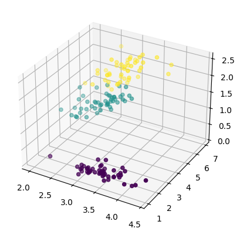
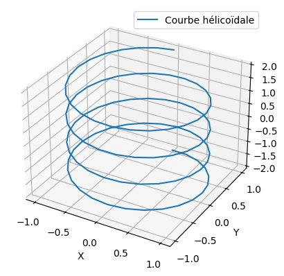
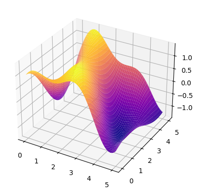

# Cour :  **Graphiques 3D**


## 1. **Introduction :**

-   Pour créer des graphiques 3D en Python, `matplotlib` fournit un sous-module appelé `mpl_toolkits.mplot3d`. Avec celui-ci, vous pouvez réaliser des visualisations en trois dimensions, telles que des nuages de points, des surfaces, ou des courbes.

-   Avant de créer un graphique 3D, vous devez initialiser un axe 3D en utilisant `Axes3D` :

    ```python
    import matplotlib.pyplot as plt
    from mpl_toolkits.mplot3d import Axes3D
    ax = plt.axes(projection="3d")
    ```


## 2. **Nuage de points 3D: `ax.scatter(x , y , z)`**

- Un nuage de points 3D (`scatter plot`) est idéal pour visualiser des ensembles de données en trois dimensions.

- **Syntaxe :**

    ```python
    ax = plt.axes(projection='3d')
    ax.scatter(x[:,1] , x[:,2] , x[:,3] , c=y )
    ```





## 3. **Courbe 3D: `ax.plot(x, y, z)`**

- Une courbe 3D peut être utile pour montrer l'évolution d'une valeur dans l'espace.

- **Syntaxe :**

    ```python
    # Données pour une courbe hélicoïdale
    theta = np.linspace(-4 * np.pi, 4 * np.pi, 100)
    z = np.linspace(-2, 2, 100)
    x = np.sin(theta)
    y = np.cos(theta)

    # Création de la figure et de l'axe 3D
    fig = plt.figure()
    ax = fig.add_subplot(111, projection='3d')

    # Courbe 3D
    ax.plot(x, y, z, label='Courbe hélicoïdale')
    ax.set_xlabel('X')
    ax.set_ylabel('Y')
    ax.set_zlabel('Z')
    ax.legend()
    plt.show()
    ```



## 4. **Surface 3D: `ax.plot_surface(X,Y,Z)`**

- Une surface 3D (`surface plot`) peut être utilisée pour représenter une fonction à deux variables.

- **Syntaxe :**

    ```python
    import numpy as np
    from mpl_toolkits.mplot3d import Axes3D
    f = lambda x,y : np.sin(x) + np.cos(x+y)*np.cos(x)
    X = np.linspace(0,5,100)
    Y = np.linspace(0,5,100)
    X,Y = np.meshgrid(X,Y)
    Z = f(X,Y)
    ax =plt.axes(projection='3d')
    ax.plot_surface(X,Y,Z,cmap="plasma")
    ```



### RQ : la fonction : **`np.meshgrid`**

-   La fonction `np.meshgrid` de la bibliothèque `NumPy` est utilisée pour créer des matrices de coordonnées à partir de deux vecteurs 1D, ce qui est particulièrement utile pour le traçage en 3D et le calcul sur des grilles. Elle permet de générer un maillage cartésien qui peut être utilisé pour évaluer des fonctions sur une grille 2D ou 3D.

-   **Syntaxe:**

    ```python
    X, Y = np.meshgrid(x, y)
    ```

    -   La fonction retourne deux tableaux 2D, chacun de la même taille que la grille définie par `x` et `y`. `X` contient les répétitions de `x` dans chaque colonne, et `Y` contient les répétitions de `y` dans chaque ligne.

-   **Exemple:**

    ```python
    x = np.array([1, 2, 3])
    y = np.array([4, 5])

    X, Y = np.meshgrid(x, y)
    print("X:\n", X)
    print("Y:\n", Y)
    ```

    ```
    X:
    [[1 2 3]
    [1 2 3]]
    Y:
    [[4 4 4]
    [5 5 5]]
    ```

    
