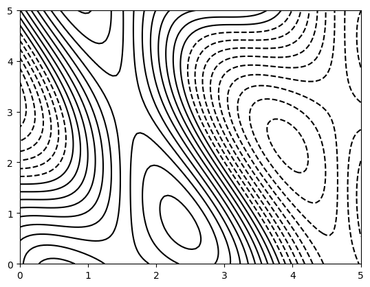
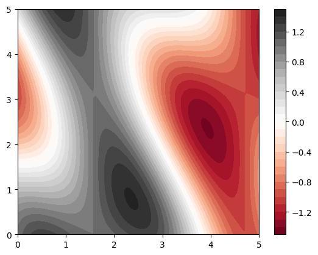

# Cour : **contour plot:**

-   **Description:**

    -   une ligne de niveau (contour) représente tous les points (𝑥,𝑦) pour lesquels la valeur de 𝑧 = f(x,y) est constante

    -   Les **contour plots** (ou courbes de niveau) sont des graphiques utilisés pour représenter une fonction en deux dimensions. Ils montrent des lignes de contour, où chaque ligne représente un niveau constant de la fonction. Les zones délimitées par ces lignes peuvent être colorées pour indiquer différentes valeurs de la fonction.

-   **`plt.contour`:**

    ```python
    plt.contour(X, Y, Z, levels=None, colors=None cmap=None)
    ```

    -   **X, Y** : Coordonnées de la grille, créées généralement avec `np.meshgrid`.
    -   **Z** : Fonction ou matrice de valeurs représentant les hauteurs pour chaque paire `(X, Y)`.
    -   **levels** : Nombre ou liste des niveaux de contour à afficher.
    -   **colors** : Couleur des lignes de contour. Peut être une couleur unique ou une liste de couleurs.
    -   **cmap** : Palette de couleurs pour les niveaux si `colors` n’est pas spécifié.

    ```python
    f = lambda x,y : np.sin(x) + np.cos(x+y)*np.cos(x)
    X = np.linspace(0,5,100)
    Y = np.linspace(0,5,100)
    X,Y = np.meshgrid(X,Y)
    Z = f(X,Y)
    plt.contour(X,Y,Z , 20 , colors="black")
    ```

    

-   **`plt.contourf:`**

    ```python
    plt.contourf(X, Y, Z, levels=None, cmap=None)
    ```

    -   **levels** : Nombre ou liste des niveaux de contour. Si non spécifié, `matplotlib` choisit des niveaux par défaut.
    -   **cmap** : Colormap pour colorier les niveaux entre les lignes de contour. Les colormaps courantes sont `'viridis'`, `'plasma'`, `'coolwarm'`, etc.

    ```python
    f = lambda x,y : np.sin(x) + np.cos(x+y)*np.cos(x)
    X = np.linspace(0,5,100)
    Y = np.linspace(0,5,100)
    X,Y = np.meshgrid(X,Y)
    Z = f(X,Y)
    plt.contourf(X,Y,Z , 30 , cmap="RdGy")
    plt.colorbar()
    ```

    


### RQ : **Différence entre `plt.contour` et `plt.contourf`**

-   **`plt.contour`** : Affiche uniquement les lignes de contour, utile pour visualiser la forme de la surface.
-   **`plt.contourf`** : Remplit les régions entre les lignes, avec des couleurs indiquant les valeurs des niveaux, ce qui rend les variations de valeur plus faciles à interpréter visuellement.

Ces deux types de contour plots sont très pratiques pour analyser des fonctions en deux dimensions, particulièrement lorsqu’on veut observer l'évolution d'une variable sans la complexité d'un graphique 3D.
