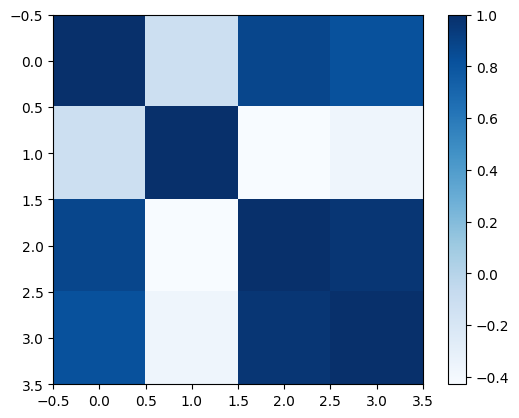

# Cour : **Graphique `plt.imshow`:**

-   **Description:**

    > La fonction `plt.imshow()` de Matplotlib est utilisée pour afficher des images, souvent sous forme de matrices ou d'images en niveaux de gris et en couleur, dans un environnement graphique. Elle est particulièrement utile pour visualiser des données matricielles ou des images en utilisant des nuances ou des cartes de couleur.

-   **Syntaxe:**

    ```python
    plt.imshow(Z, cmap='viridis') # avec Z une np.array
    plt.colorbar()  # Ajoute une barre de couleur
    plt.title("Affichage de la matrice avec imshow")
    plt.show()
    ```

-   **Exemple 1:**

    ```python
    f = lambda x,y : np.sin(x) + np.cos(x+y)*np.cos(x)
    X = np.linspace(0,5,100)
    Y = np.linspace(0,5,100)
    X,Y = np.meshgrid(X,Y)
    Z = f(X,Y)
    plt.imshow(Z)
    plt.colorbar()
    ```

    

-   **Exemple 2: `matrice de Corrélation`**

    ```python
    from sklearn.datasets import load_iris
    df = load_iris()
    x = df.data
    plt.imshow(np.corrcoef(x.T) , cmap="Blues")
    plt.colorbar()
    ```

    