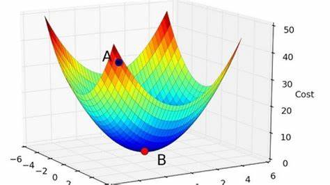
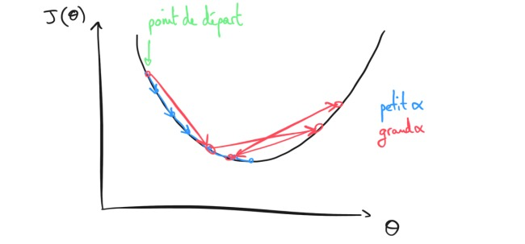

# cour 04 : **algorithme d’optimisation Gradient Descent**


## 1. Introduction :

L'algorithme de descente de gradient est une technique d'optimisation utilisée pour trouver le minimum d'une fonction de coût. Cette méthode est couramment utilisée dans le domaine du machine learning pour ajuster les paramètres d'un modèle afin de minimiser l'erreur de prédiction. 

L'idée principale derrière la descente de gradient est de suivre la pente (ou le gradient) de la fonction de coût pour atteindre le minimum global.


>L'objectif de la descente de gradient est de trouver les valeurs des paramètres qui minimisent une fonction de coût. Cette fonction de coût mesure l'écart entre les prédictions du modèle et les valeurs réelles. L'algorithme commence avec des valeurs initiales pour les paramètres du modèle et ajuste progressivement ces valeurs pour atteindre le minimum de la fonction de coût.


## 2.Fonctionnement de l'Algorithme :

1. **Initialisation :** Choisissez des valeurs initiales pour les paramètres du modèle.

2. **Calcul du Gradient :** Calculez le gradient de la fonction de coût par rapport à chaque paramètre. Le gradient indique la direction dans laquelle la fonction de coût augmente le plus rapidement.

3. **Mise à Jour des Paramètres :** Ajustez les paramètres du modèle dans la direction opposée au gradient pour minimiser la fonction de coût. La taille du pas dans cette direction est contrôlée par un hyperparamètre appelé le taux d'apprentissage.

4. **Répétition :** Répétez les étapes 2 et 3 jusqu'à ce qu'un critère d'arrêt soit atteint, tel qu'un nombre fixe d'itérations ou une petite amélioration de la fonction de coût.


## 3. Application sur Régression Simple :


Voici comment cela fonctionne pour la régression linéaire simple :

1. **Initialisation des paramètres :** Commencez par initialiser les paramètres $\beta_0$ et $\beta_1$ avec des valeurs arbitraires (souvent à zéro ou de manière aléatoire).

2. **Calcul des dérivées partielles :** Calculez les dérivées partielles de la fonction de coût par rapport à $\beta_0$ et $\beta_1$. Ces dérivées indiquent la direction dans laquelle ajuster les paramètres pour réduire la fonction de coût.


$$
\frac{\partial J}{\partial \beta_0} = \frac{1}{m} \sum_{i=1}^{m} (f_\theta(x^{(i)}) - y^{(i)})
$$
   
$$
\frac{\partial J}{\partial \beta_1} = \frac{1}{m} \sum_{i=1}^{m} (f_\theta(x^{(i)}) - y^{(i)}) \cdot x^{(i)}
$$

où $f_\theta(x^{(i)})$ est la prédiction du modèle pour l'exemple $i$.

3. **Mise à jour des paramètres :** Utilisez les dérivées partielles calculées pour mettre à jour les paramètres $\beta_0$ et $\beta_1$ en fonction du taux d'apprentissage ($\alpha$).

$$ 
\beta_0 = \beta_0 - \alpha \frac{\partial J}{\partial \beta_0} 
$$


$$
\beta_1 = \beta_1 - \alpha \frac{\partial J}{\partial \beta_1} 
$$


où $\alpha$ est le taux d'apprentissage, un hyperparamètre qui contrôle la taille des pas dans la direction opposée du gradient.

4. **Répétez :** Répétez les étapes 2 et 3 jusqu'à ce que la fonction de coût converge vers un minimum global ou que le nombre d'itérations spécifié soit atteint.

La descente de gradient permet d'ajuster progressivement les paramètres du modèle pour minimiser la fonction de coût. Le choix du taux d'apprentissage est crucial, car un taux trop élevé peut entraîner une divergence, tandis qu'un taux trop bas peut ralentir la convergence.




- Implémentation en python :

```python

def modele( a , b, x):
    "fonction du modéle de regression lineaire "
    return a*x + b 


def cout(X , Y ):
    " fonction, de cout du modéle de regression linéaire "
    m = len(Y) # le nombres d'exemples 
    predictions = [modele(x) for x in X] # [f(x_i) avec  x_i : fearture]

    cout = (1/(2*m))*sum([(predictions[i]-Y[i])**2 for i in range(m)])

    return cout 

def derive_cout_a(X , Y , a , b) :
    return (1/len(Y))*sum([ ( modele(a , b, X[i]) - Y[i] ) * X[i] for i in range(len(Y))])


def derive_cout_b(X , Y , a ,b ):

    return (1/len(Y))*sum([ modele(a , b, X[i]) - Y[i]  for i in range(len(Y))])


def algo_gradient(X , Y , nb , alpha):

    "etape 4 : Algo d'apprentissage --> Algo de gradiente descendante "

    a = 0 
    b  = 0 

    for _ in range(nb):
        a-=alpha*derive_cout_a(X , Y , a ,b)
        b-=alpha*derive_cout_b(X , Y , a , b)

    return a , b


# dataset :
X = [2 , 4, 3, 5 , 6 , 10] # features 
Y = [5 , 9 , 7 , 11 , 13 , 21] # target 
nb =  100000  # le nombre de fois d'app 
alpha = 0.01 # le vitesse d'app 


# donc notre modele mnt est pres apres la pahase d'apprentissage :
a , b = algo_gradient(X , Y , nb , alpha)

print(f'aprés la pahase d\'apprentissage a = {a} et b = {b} ')

```


## 4. Taux d'Apprentissage :

- **Définition:**
    >Le taux d'apprentissage (``learning rate`` en anglais) est un hyperparamètre essentiel dans les algorithmes d'optimisation, en particulier dans le contexte de la descente de gradient utilisée pour ajuster les paramètres d'un modèle. Il contrôle la taille des pas pris lors de la mise à jour des paramètres du modèle afin de minimiser la fonction de coût.


- **Choix du Taux d'Apprentissage :**
   - **Taux Faible :** Un taux d'apprentissage très faible peut entraîner une convergence lente. Cela signifie que le modèle mettra plus de temps à atteindre le minimum global de la fonction de coût.
   - **Taux Élevé :** Un taux d'apprentissage trop élevé peut entraîner une divergence. Le modèle peut osciller autour du minimum ou même ne pas converger du tout.




En résumé, le taux d'apprentissage est un paramètre crucial qui nécessite une attention particulière lors de l'entraînement de modèles. Il joue un rôle majeur dans la performance et la stabilité de l'algorithme d'optimisation. Des techniques avancées peuvent également être utilisées pour adapter dynamiquement le taux d'apprentissage en fonction de l'évolution de l'optimisation.


### RQ :Variations de la Descente de Gradient :

- Il existe plusieurs variantes de la descente de gradient, telles que la descente de gradient stochastique (SGD), la descente de gradient par mini-lot (mini-batch), et d'autres, qui modifient la manière dont les paramètres sont mis à jour.

- Certains algorithmes d'optimisation ajustent dynamiquement le taux d'apprentissage au fil du temps. Par exemple, l'algorithme Adam adapte le taux d'apprentissage pour chaque paramètre en fonction de l'historique des gradients.
