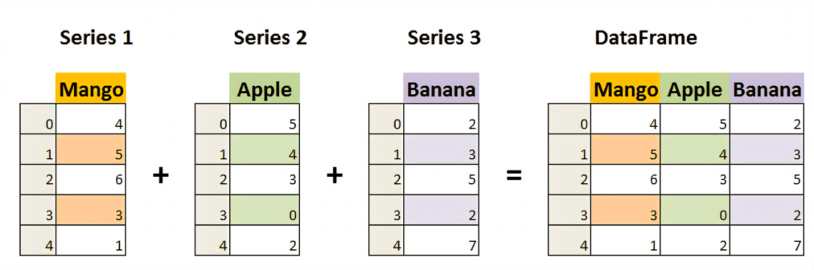

# cour 01 : **Introduction:**

## 1. **Introduction :**

-   `Pandas` est une bibliothèque open source de Python, conçue pour la manipulation et l'analyse de données. Elle offre des structures de données performantes et flexibles, telles que la **Series** (tableau unidimensionnel) et le **DataFrame** (tableau bidimensionnel similaire à une feuille de calcul ou à une table SQL), qui facilitent la gestion de données tabulaires et étiquetées.

-   Avec Pandas, les utilisateurs peuvent importer, nettoyer, transformer, analyser et visualiser des ensembles de données de manière efficace

-   Principales caractéristiques de Pandas

    -   **Structures de données puissantes** : Pandas offre deux structures de données principales :

        -   **Series** : un tableau unidimensionnel semblable à un tableau de données indexé.
        -   **DataFrame** : une structure bidimensionnelle semblable à une feuille de calcul Excel ou une table SQL, avec des lignes et des colonnes, qui est au cœur de la bibliothèque.

    -   **Chargement et écriture de données** : Pandas prend en charge l'importation et l'exportation de données depuis et vers divers formats, tels que CSV, Excel, SQL, JSON, etc.

    -   **Manipulation facile** : La bibliothèque permet de réaliser des opérations comme le filtrage, le tri, l'agrégation, la fusion et la pivotation de données de manière simple et efficace.

    -   **Gestion des données manquantes** : Pandas offre des outils intégrés pour gérer facilement les données manquantes ou incomplètes.

-   **Exemple d'utilisation de base:**

    ```python
    import pandas as pd

    # Créer un DataFrame à partir d'un dictionnaire
    data = {
        'Nom': ['Alice', 'Bob', 'Charlie'],
        'Âge': [25, 30, 35],
        'Ville': ['Paris', 'Lyon', 'Marseille']}
    df = pd.DataFrame(data)

    # Afficher le DataFrame
    print(df)

    # Résultats:
    #        Nom  Âge      Ville
    # 0    Alice   25      Paris
    # 1      Bob   30       Lyon
    # 2  Charlie   35  Marseille
    ```

## 2. La classe **Series** :

-   **Definition:**

    > La classe **Series** de Pandas est une structure de données unidimensionnelle qui peut contenir des données de tout type (entiers, chaînes de caractères, flottants, etc.), similaires à un tableau ou une liste en Python, mais avec des étiquettes (index) associées à chaque élément. Les étiquettes peuvent être des chaînes de caractères, des entiers, ou d'autres types immutables.

-   **Exemple 1 : Création à partir d'une liste**

    ```python
    import pandas as pd

    # Création d'une Series à partir d'une liste
    s = pd.Series([10, 20, 30, 40], index=['a', 'b', 'c', 'd'])
    print(s)

    # Résultat :
    # a    10
    # b    20
    # c    30
    # d    40
    # dtype: int64
    ```

-   **Exemple 2 : Création à partir d'un dictionnaire**

    ```python
    data = {'Paris': 200, 'Lyon': 150, 'Marseille': 180}
    s = pd.Series(data)
    print(s)

    # Résultat :
    # Paris        200
    # Lyon         150
    # Marseille    180
    # dtype: int64
    ```

-   **Accès aux éléments:**

    Vous pouvez accéder aux éléments de la Series en utilisant l'index :

    ```python
    print(s['Paris'])  # Affiche 200
    ```

## 3 .**DataFrame :**

-   **Definition:**

    > Le **DataFrame** est la structure de données bidimensionnelle principale de la bibliothèque Pandas. Il peut être considéré comme une table de données avec des lignes et des colonnes, similaire à une feuille de calcul Excel ou une table SQL. Chaque colonne d'un DataFrame est une **Series**, et les lignes et colonnes peuvent avoir des étiquettes pour un accès et une manipulation facilités.

-   **Exemple 1 : Création à partir d'un dictionnaire de listes**

    ```python
    import pandas as pd

    # Création d'un DataFrame à partir d'un dictionnaire de listes
    data = {
        'Nom': ['Alice', 'Bob', 'Charlie'],
        'Âge': [25, 30, 35],
        'Ville': ['Paris', 'Lyon', 'Marseille']
    }
    df = pd.DataFrame(data)
    print(df)

    # Résultat :
    #        Nom  Âge      Ville
    # 0    Alice   25      Paris
    # 1      Bob   30       Lyon
    # 2  Charlie   35  Marseille
    ```

-   **Exemple 2 : Création à partir d'un tableau NumPy**

    ```python
    import numpy as np

    # Création d'un DataFrame à partir d'un tableau NumPy
    arr = np.array([[1, 2, 3], [4, 5, 6], [7, 8, 9]])
    df = pd.DataFrame(arr, columns=['Colonne1', 'Colonne2', 'Colonne3'])
    print(df)

    # Résultat :
    #    Colonne1  Colonne2  Colonne3
    # 0         1         2         3
    # 1         4         5         6
    # 2         7         8         9
    ```


