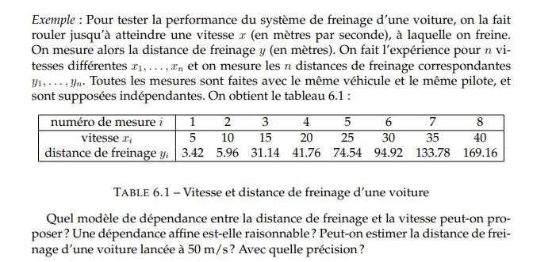
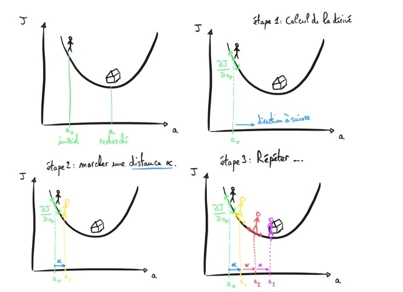

# cour 03 :   Régression Linéaire Simple :

## 1.Introduction :

### **problème de régression**


Un problème de régression consiste à chercher une fonction $f$ telle que pour tout $i$ ,  $Y_i$ soit approximativement égale à $f(X_i)$. 
Le cas le plus simple est celui de la ``régression linéaire simple``, où on cherche $f$ de la forme 

$$
f(x) = \beta_1.x + \beta_0
$$


Pour estimer $\beta_1$ et β0, on peut  utilise la fameuse méthode des moindres carrés ou la méthode de descende gradient .


### **La régression linéaire simple:**

La régression linéaire simple est une technique fondamentale en Machine Learning utilisée pour modéliser la relation entre une variable d'entrée (caractéristique) et une variable de sortie (étiquette) par une fonction linéaire. Concrètement, elle cherche à établir une équation linéaire qui représente au mieux la tendance des données.

L'objectif de la régression linéaire simple dans le contexte du Machine Learning est de trouver les paramètres optimaux d'une droite de régression qui minimise l'erreur de prédiction entre les valeurs observées et celles prédites par le modèle. Cette droite est représentée par l'équation :

$$ 
Y = \beta_0 + \beta_1 \cdot X + \varepsilon
$$


où :
- $Y$ est la variable de sortie (étiquette),
- $X$ est la variable d'entrée (caractéristique),
- $\beta_0$ est le terme constant (ordonnée à l'origine),
- $\beta_1$ est le coefficient associé à la variable d'entrée,
- $\varepsilon$ représente l'erreur résiduelle.

Les paramètres $\beta_0$ et $\beta_1$ sont estimés à partir des données d'entraînement en utilisant des techniques d'optimisation telles que la méthode des moindres carrés.

Une fois le modèle ajusté, il peut être utilisé pour effectuer des prédictions sur de nouvelles données en appliquant la formule linéaire. La régression linéaire simple est particulièrement utile pour comprendre et prédire des relations linéaires entre une seule caractéristique et une variable cible.


Exemple :



## 2. la fonction  de coût : 

La fonction de coût pour la régression linéaire simple mesure l'écart entre les valeurs prédites par le modèle et les valeurs réelles observées dans l'ensemble d'entraînement. 

Une forme courante de la fonction de coût pour la régression linéaire simple est la somme des carrés des erreurs (ou moindres carrés) qui cherche à minimiser la différence quadratique entre les valeurs prédites et réelles. 

Formellement, la fonction de coût $J$ est définie comme suit :

$$
J(\beta_0, \beta_1) = \frac{1}{2m} \sum_{i=1}^{m} (f_\theta(x^{(i)}) - y^{(i)})^2 
$$

où :
- $J(\beta_0, \beta_1)$ est la fonction de coût,
- $m$ est le nombre d'exemples d'entraînement,
- $f_\theta(x^{(i)})$ est la prédiction du modèle pour l'exemple $i$,
- $y^{(i)}$ est la valeur réelle pour l'exemple $ i $,
- $\beta_0$ est l'ordonnée à l'origine (constante),
- $\beta_1$ est la pente de la droite de régression.

L'objectif de l'apprentissage est de minimiser cette fonction de coût en ajustant les paramètres $\beta_0$ et $\beta_1$ du modèle. Ceci est généralement réalisé à l'aide d'un algorithme d'optimisation tel que la descente de gradient.

Le facteur $\frac{1}{2} $ est inclus dans la fonction de coût pour simplifier les calculs de la dérivée lors de l'optimisation, mais il n'affecte pas substantiellement la solution finale. L'optimisation vise à trouver les valeurs de $\beta_0$ et $\beta_1$ qui minimisent cette fonction de coût, permettant au modèle de mieux représenter la relation linéaire entre la variable d'entrée et la variable de sortie.


## 3. Algo de minimisation :

L'algorithme de minimisation communément utilisé pour ajuster les paramètres $\beta_0$ et $\beta_1$ de la régression linéaire simple est la descente de gradient. La descente de gradient est un algorithme d'optimisation qui ajuste progressivement les paramètres du modèle pour minimiser la fonction de coût. 


Voici comment cela fonctionne pour la régression linéaire simple :

1. **Initialisation des paramètres :** Commencez par initialiser les paramètres $\beta_0$ et $\beta_1$ avec des valeurs arbitraires (souvent à zéro ou de manière aléatoire).

2. **Calcul des dérivées partielles :** Calculez les dérivées partielles de la fonction de coût par rapport à $\beta_0$ et $\beta_1$. Ces dérivées indiquent la direction dans laquelle ajuster les paramètres pour réduire la fonction de coût.


$$
\frac{\partial J}{\partial \beta_0} = \frac{1}{m} \sum_{i=1}^{m} (f_\theta(x^{(i)}) - y^{(i)})
$$
   
$$
\frac{\partial J}{\partial \beta_1} = \frac{1}{m} \sum_{i=1}^{m} (f_\theta(x^{(i)}) - y^{(i)}) \cdot x^{(i)}
$$

où $f_\theta(x^{(i)})$ est la prédiction du modèle pour l'exemple $i$.

3. **Mise à jour des paramètres :** Utilisez les dérivées partielles calculées pour mettre à jour les paramètres $\beta_0$ et $\beta_1$ en fonction du taux d'apprentissage ($\alpha$).

$$ 
\beta_0 = \beta_0 - \alpha \frac{\partial J}{\partial \beta_0} 
$$


$$
\beta_1 = \beta_1 - \alpha \frac{\partial J}{\partial \beta_1} 
$$


où $\alpha$ est le taux d'apprentissage, un hyperparamètre qui contrôle la taille des pas dans la direction opposée du gradient.

4. **Répétez :** Répétez les étapes 2 et 3 jusqu'à ce que la fonction de coût converge vers un minimum global ou que le nombre d'itérations spécifié soit atteint.

La descente de gradient permet d'ajuster progressivement les paramètres du modèle pour minimiser la fonction de coût. Le choix du taux d'apprentissage est crucial, car un taux trop élevé peut entraîner une divergence, tandis qu'un taux trop bas peut ralentir la convergence.




## 4. **Implémentation:**


- une implémentation simple de la régression linéaire simple avec la descente de gradient en utilisant Python et la bibliothèque NumPy:

```python
import numpy as np
import matplotlib.pyplot as plt

def modele(X, beta0, beta1):
    return beta0 + beta1 * X

def cout(X, y, beta0, beta1):
    m = len(y)
    predictions = modele(X, beta0, beta1)
    cost = (1/(2*m)) * np.sum((predictions - y)**2)
    return cost

def gradient_descent(X, y, beta0, beta1, alpha, num_iterations):
    m = len(y)
    costs = []

    for _ in range(num_iterations):
        predictions = modele(X, beta0, beta1)
        error = predictions - y

        beta0 -= alpha * (1/m) * np.sum(error)
        beta1 -= alpha * (1/m) * np.sum(error * X)

        cost = cout(X, y, beta0, beta1)
        costs.append(cost)

    return beta0, beta1, costs

# Générer des données synthétiques
np.random.seed(0)
X = 2 * np.random.rand(100, 1)
y = 4 + 3 * X + np.random.randn(100, 1)

# Initialiser les paramètres
beta0 = 0
beta1 = 0

# Définir les hyperparamètres
alpha = 0.01
num_iterations = 1000

# Appliquer la descente de gradient
beta0, beta1, costs = gradient_descent(X, y, beta0, beta1, alpha, num_iterations)

# Afficher les résultats
print("Paramètres finaux après descente de gradient :")
print("beta0 =", beta0)
print("beta1 =", beta1)

# Tracer la courbe d'apprentissage
plt.plot(range(num_iterations), costs)
plt.xlabel('Nombre d\'itérations')
plt.ylabel('Coût')
plt.title('Courbe d\'apprentissage')
plt.show()
```

Dans cet exemple, nous générons d'abord des données synthétiques, puis nous appliquons la descente de gradient pour ajuster les paramètres $\beta_0$ et $\beta_1$. 

La courbe d'apprentissage est tracée pour illustrer la convergence du coût au fil des itérations.


### Explication :

examinons le code en détail:


```python
def modele(X, beta0, beta1):
    return beta0 + beta1 * X
```

Cette fonction `modele` prend en entrée une variable d'entrée `X` ainsi que les paramètres de la régression linéaire ($\beta_0$ et $\beta_1$) et retourne les prédictions du modèle.

```python
def cout(X, y, beta0, beta1):
    m = len(y)
    predictions = modele(X, beta0, beta1)
    cost = (1/(2*m)) * np.sum((predictions - y)**2)
    return cost
```

La fonction `cout` calcule la fonction de coût pour un ensemble de données donné et les paramètres de la régression linéaire.

```python
def gradient_descent(X, y, beta0, beta1, alpha, num_iterations):
    m = len(y)
    costs = []

    for _ in range(num_iterations):
        predictions = modele(X, beta0, beta1)
        error = predictions - y

        beta0 -= alpha * (1/m) * np.sum(error)
        beta1 -= alpha * (1/m) * np.sum(error * X)

        cost = cout(X, y, beta0, beta1)
        costs.append(cost)

    return beta0, beta1, costs
```

La fonction `gradient_descent` implémente l'algorithme de descente de gradient. Elle prend les données d'entraînement, les paramètres initiaux ($\beta_0$ et $\beta_1$), le taux d'apprentissage (`alpha`), et le nombre d'itérations comme arguments. À chaque itération, elle ajuste les paramètres en fonction du gradient de la fonction de coût par rapport à ces paramètres.

```python
# Générer des données synthétiques
np.random.seed(0)
X = 2 * np.random.rand(100, 1)
y = 4 + 3 * X + np.random.randn(100, 1)
```

Dans ces lignes, nous générons des données synthétiques pour tester notre modèle. Ces données suivent une relation linéaire, et nous ajoutons un peu de bruit avec `np.random.randn(100, 1)`.

```python
# Initialiser les paramètres
beta0 = 0
beta1 = 0
```

Nous initialisons les paramètres de la régression linéaire.

```python
# Définir les hyperparamètres
alpha = 0.01
num_iterations = 1000
```

Nous définissons les hyperparamètres de l'algorithme, tels que le taux d'apprentissage (`alpha`) et le nombre d'itérations.

```python
# Appliquer la descente de gradient
beta0, beta1, costs = gradient_descent(X, y, beta0, beta1, alpha, num_iterations)
```

Nous appliquons la descente de gradient en appelant la fonction `gradient_descent`.

```python
# Afficher les résultats
print("Paramètres finaux après descente de gradient :")
print("beta0 =", beta0)
print("beta1 =", beta1)
```

Nous affichons les paramètres finaux après l'entraînement du modèle.

```python
# Tracer la courbe d'apprentissage
plt.plot(range(num_iterations), costs)
plt.xlabel('Nombre d\'itérations')
plt.ylabel('Coût')
plt.title('Courbe d\'apprentissage')
plt.show()
```

Enfin, nous traçons la courbe d'apprentissage pour visualiser comment le coût diminue au fil des itérations, ce qui indique la convergence de l'algorithme de descente de gradient.